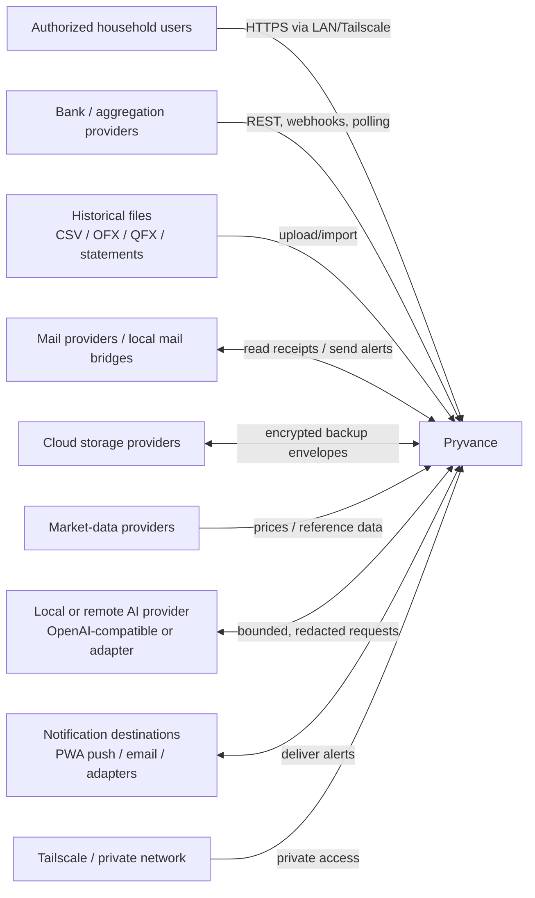
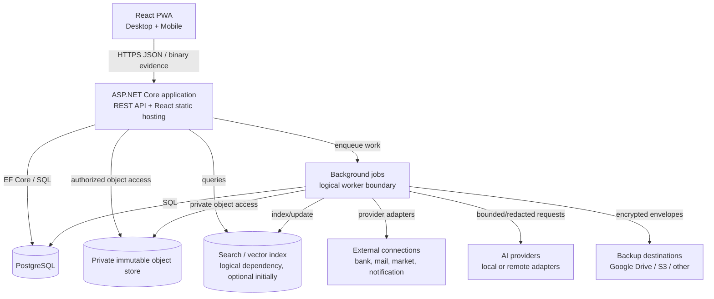
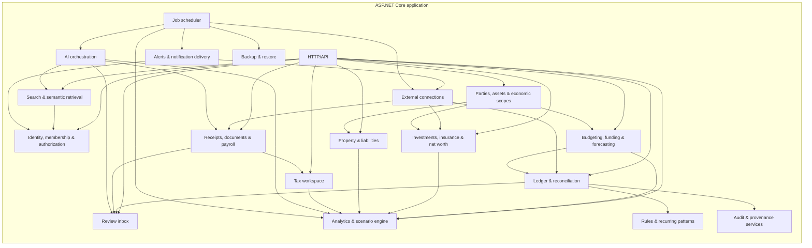
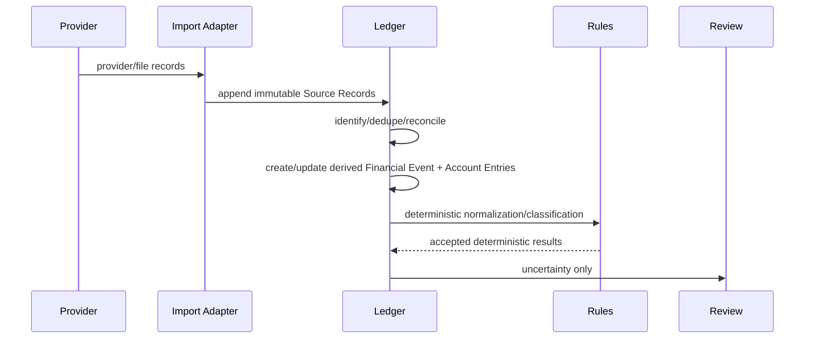
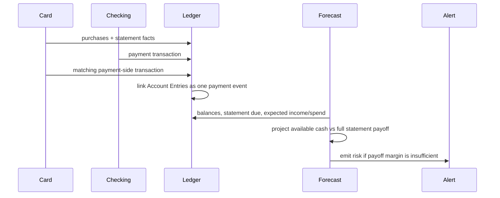
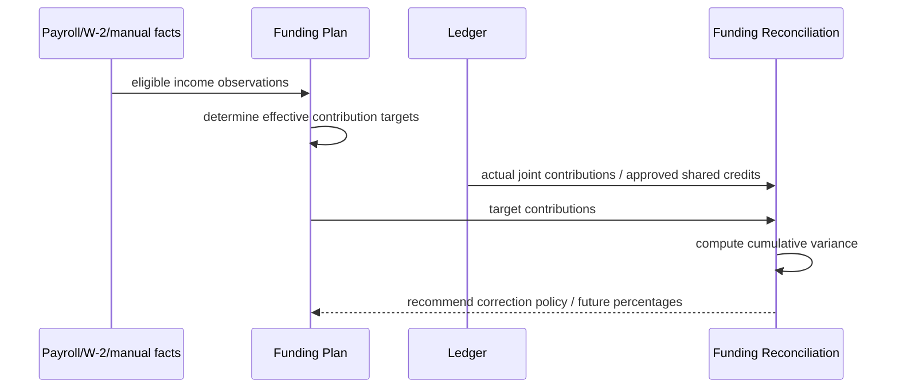
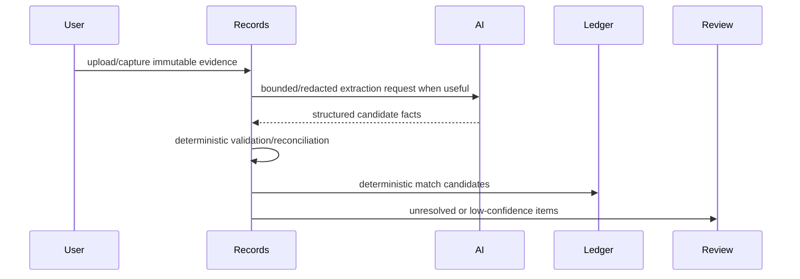
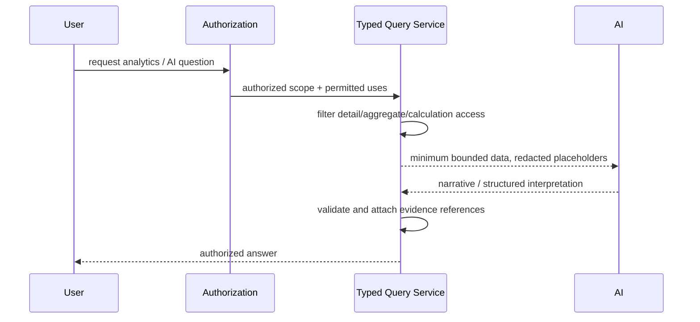
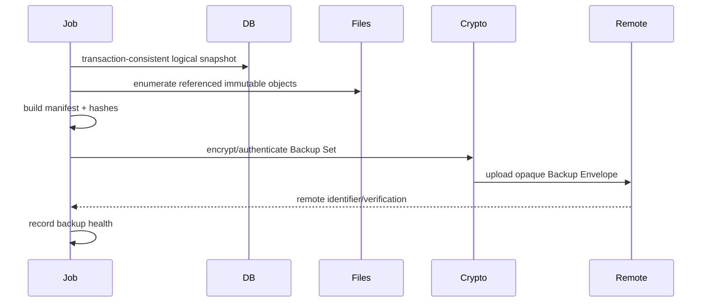

# Pryvance architecture

Kind: explanation

Pryvance is a self-hosted, local-first household financial platform. This document describes the intended feature-complete architecture for the product vision currently approved. It is not limited to the first implementation milestone. The delivery roadmap controls sequencing; later roadmap phases must still conform to this target architecture.

The architecture favors one Household root per Pryvance installation, explicit domain boundaries, immutable source evidence, deterministic financial truth, privacy-aware analytics, provider-neutral integrations, optional AI, and encrypted offsite recovery.

## Architecture scope

A Pryvance installation represents one Household. That Household may contain any number of People, Financial Entities, Accounts, Assets, liabilities, tax filing contexts, policies, documents, plans, and reporting scopes. The architecture does not implement SaaS-style multi-tenancy between unrelated households.

A Person may participate without connecting accounts or exposing detailed financial data. Financial cooperation, tax filing, shared planning, and reporting therefore depend on explicit visibility and calculation permissions rather than assumptions that all Household data is globally visible.

## C4 — system context

External providers are data sources, delivery targets, or storage dependencies; they are never the source of truth for Pryvance's normalized financial interpretation. Provider choice remains replaceable behind internal interfaces.

Offsite backup destinations are outside the confidentiality trust boundary. They receive only encrypted Backup Envelopes and the minimum transport metadata required to store them.

AI providers are correctness-untrusted. A local model is the expected default, but the architecture is provider-neutral so an operator may explicitly attach another provider. Sensitive fields are redacted or replaced with stable placeholders before AI requests unless a feature explicitly requires the original value and authorization permits it.

## C4 — containers

Initial deployment may place App and Worker in one ASP.NET Core process and omit a dedicated Search service until required. Those are deployment decisions, not domain-boundary shortcuts. Target-state interfaces allow Worker or Search to move into separate containers without changing the domain model.

PostgreSQL is reachable only on the internal Docker network. Receipt/document originals are held in private storage and are not exposed as a public filesystem. Remote access is expected through Tailscale or an equivalent private network rather than direct public exposure.

## C4 — application components

### Identity, membership and authorization

Owns User Identities, Household Memberships, guardian relationships, roles, filing-context access, and Visibility Policies. A User Identity is not the same thing as a Person. Every installation containing real data requires authentication even if only one User Identity is initially active.

Authorization distinguishes at least:

1. may the viewer see record details;
2. may data contribute to an aggregate shown to the viewer;
3. may data be used in a Household calculation without exposing the underlying detail;
4. may data participate in a Tax Filing Context;
5. may the viewer mutate ownership, visibility, verification, planning, or administrative state.

These checks apply before data reaches serialization, search, Review, analytics, AI, notifications, exports, counts, autocomplete, evidence traversal, or scheduled insights.

### Parties, assets and economic scopes

Owns People, Financial Entities, recursive entity ownership, Assets, Asset Ownership, Account Ownership, and Economic Scopes. Party answers who can own/fund/receive value. Asset answers what is owned. Economic Scope answers what a financial impact belongs to for allocation, planning, and reporting.

A property is an Asset rather than automatically a Financial Entity. A Financial Entity such as an LLC or trust may own one or more Assets and may itself be partly or wholly owned by People or other Financial Entities. Ownership cycles are forbidden.

Economic Scopes can represent Household, Person, Financial Entity, or Asset views. The same underlying Asset or liability may contribute to multiple visible scopes, but net-worth aggregation deduplicates canonical economic items and follows ownership paths so value is not counted twice.

### Ledger and reconciliation

Owns immutable Source Records, Source Relationships, normalized Financial Events, Account Entries, deterministic identity/deduplication, pending-to-posted relationships, transfer/payment matching, currency facts, and reconciliation links.

A Financial Event may have multiple Account Entries. This supports linked two-sided movements such as checking-to-credit-card payments without treating the payment as spending. Multiple Source Records may support or supersede one another and may reconcile to one event or related entries without rewriting original evidence.

Manual observations use the same Source Record and Provenance model rather than bypassing evidence semantics.

### Budgeting, household funding and forecasting

Owns Budget Plans and versions, Household Funding Plans and versions, Contribution Targets, Funding Reconciliations, Reserve Buckets, Commitments, Savings Goals, Expected Cash Flows, recurring accepted patterns, short-range cash forecasts, and long-range Scenarios.

Shared-spending fairness is primarily a funding-reconciliation problem, not an interpersonal debt ledger. The system may show contribution variance and carry it forward under a configurable correction policy. Explicit direct Obligations remain available when the Household deliberately chooses debt/settlement semantics.

Forecasting combines current balances, expected income, committed bills, credit-card statements, recurring expectations, reserves, savings targets, and planned contributions. Scenario projections run against isolated assumptions and never mutate observed financial truth.

### Investments, insurance and net worth

Owns investment accounts, Securities/Instruments, holdings, transactions, tax lots/cost basis where known, price observations, valuation snapshots, contribution facts, performance calculations, Insurance Policies, whole-life cash-value facts, policy loans, illustrations, and Known Net Worth.

Performance calculations publish the method and data coverage required for the result. Unknown or insufficient history produces unavailable/partial results rather than fabricated return metrics.

Insurance death benefit is coverage, not current net worth. Economically realizable values such as cash surrender value may contribute to net worth, with policy loans reducing attributable value as appropriate.

### Property and liabilities

Owns specialized Asset and Liability facts for real estate and similar tracked property: mortgages, principal/interest/escrow observations, leases, security-deposit liabilities, operating expenses, owner funding, valuations, and repair/capital-treatment candidates.

Tax treatment remains reviewable. AI may suggest a candidate classification but does not silently decide whether an expense is deductible, capital, depreciable, or otherwise tax-sensitive.

### Receipts, documents and payroll

Stores immutable originals by content hash and keeps extracted/verified facts separately. Receipt line items support independent category and Economic Scope allocation. Known financial forms use versioned schemas where practical.

Payroll is a structured financial fact family rather than merely a Document type. Pay stubs may produce gross pay, taxes, deductions, employee retirement contributions, employer contributions, benefits, and net pay, with the net amount reconciled to bank deposits when possible.

Original evidence is retained indefinitely by default. Configurable retention may explicitly delete source material, with warnings that provenance is weakened and older encrypted backups may continue to contain the artifact until those recovery points expire.

### Tax workspace

Tax is a projection and evidence workspace over existing ledger, document, payroll, investment, property, insurance, and extracted-fact data. It does not attempt to become tax-return preparation or e-filing software.

Tax Filing Contexts are year-specific and may be Joint or Individual. A joint context can authorize access to the participants' required tax documents for preparation even when ordinary financial visibility is narrower. An individual context may allow selected private tax facts to participate in Household fairness calculations without revealing the underlying document or detailed fields.

The workspace supports document completeness, evidence collection, W-2/1099/1098-style extraction, receipt/document retrieval, Schedule-E-style organization, candidate tax classifications, accountant exports, and AI-assisted question answering with provenance.

### Review inbox

Centralizes uncertain outputs across ingestion, matching, classification, allocation, extracted facts, recurring detection, investment reconciliation, insurance recognition, tax candidates, anomalies, and AI suggestions. Review Items carry evidence, reason, candidate resolution, confidence where relevant, owner module, and resolution history.

### Rules and recurring patterns

Applies deterministic merchant/category/normalization rules and stores accepted Recurring Patterns. Machine or AI analysis may suggest a recurring pattern, anomaly, or forgotten subscription; deterministic pattern definitions drive forecasts after acceptance.

Expected cash flow distinguishes inferred recurrence from known commitments. A missing expected paycheck, changed recurring bill, dormant recurring charge, or unexpected amount increase may produce an Alert or Review Item.

### Analytics and scenario engine

Owns typed deterministic queries, cross-domain projections, trend analysis, anomaly detection, household-funding reconciliation, cash-flow forecasting, net-worth traversal, and What If scenarios.

Analytics can answer both current-knowledge and historical-knowledge questions. Effective dates describe when a fact/policy applies; knowledge/audit timestamps preserve what the system knew at a prior time. This allows both retrospective recalculation with newly discovered evidence and audit of prior recommendations.

### Search and semantic retrieval

Indexes only data the requesting context is allowed to expose. Search authorization is not deferred until result rendering. Semantic search over documents/receipts may use embeddings after structured extraction is mature; indexes retain source identity and authorization metadata so private records cannot leak through matches, counts, snippets, or similarity results.

### AI orchestration

Uses a provider-neutral AI interface. AI endpoints expose bounded application tools and structured schemas, not unrestricted SQL. Sensitive fields such as SSNs, full account numbers, policy/account identifiers, access tokens, and similar values are redacted by default and replaced with stable placeholders when semantic continuity is useful.

The model may classify, extract, normalize, summarize, explain, compare, or choose among bounded candidates. Application code owns arithmetic, authorization, reconciliation, plan calculations, deterministic matching, source-of-truth writes, and validation.

### External connections

Represents provider integrations through capabilities and authentication methods rather than assuming OAuth everywhere. An External Connection records provider, owner, granted capabilities/scopes, authentication method, credential reference, health, and last verification.

Capabilities include Bank Data, Mail Read, Mail Send, Cloud Storage, Market Data, AI, and Notification Delivery. Authentication methods may include OAuth2, API key, local bridge, app password, client certificate, or provider-specific mechanisms. Credentials are encrypted at rest and never exposed to AI.

### Alerts and notification delivery

Alerts are first-class application facts; delivery is a separate adapter concern. Alerts may arise from backup failure, sync failure, cash-flow risk, credit-card payoff risk, funding shortfall, recurring anomaly, forgotten subscription, missing expected income, document/tax completeness, Review backlog, or scheduled insight.

Initial delivery targets may include in-app, PWA/Web Push, and optional email. Additional delivery mechanisms plug in without changing the alert-producing domain modules.

### Audit and provenance

Provenance explains why Pryvance believes a financial fact: source, extractor/matcher/rule version, confidence, location in evidence, and verification state.

Audit explains who or what changed application state and when. Mutable interpretations, plans, visibility policies, ownership relationships, verification state, rules, settlements, retention settings, and administrative actions produce append-only Audit Entries. Full event sourcing is not required.

### Backup and restore

Creates a point-in-time Backup Set from a transaction-consistent PostgreSQL snapshot plus referenced immutable objects, writes a versioned manifest with hashes and compatibility metadata, encrypts/authenticates locally, and uploads only the opaque Backup Envelope.

Restore decrypts into isolated staging, verifies authentication and every manifest object, checks application/schema compatibility, and only then permits recovery. Provider credentials and backup recovery secrets remain independent.

## Dynamic view — transaction/import reconciliation

## Dynamic view — credit-card payment and payoff risk

## Dynamic view — household funding reconciliation

Newly discovered historical facts may trigger a retrospective recalculation. The original recommendation and information available at that time remain auditable; the new recommendation becomes effective only from an explicit date.

## Dynamic view — receipt/document interpretation

## Dynamic view — privacy-safe analytics and AI

## Dynamic view — backup and restore

Restore performs the reverse path in isolated staging and never overwrites live data merely because an envelope downloaded successfully.

## Cross-cutting invariants

### Evidence before interpretation

Derived values never erase source evidence. UI drill-down should normally support aggregate → economic item/event → extracted/derived fact → Evidence → original artifact.

### Incomplete coverage is explicit

Unknown data is never converted to zero. Reports expose date/fact-family coverage and use qualified labels such as Known Net Worth when Household coverage is incomplete.

### Current truth and historical knowledge are both queryable

Pryvance distinguishes effective time from knowledge/audit time. Historical analytics may be recalculated using facts known today, while audit views can reconstruct what inputs and policies supported an earlier recommendation.

### Multi-currency is native

Monetary facts retain source currency. Household settings define reporting/base currency. FX observations carry source, timestamp/date, and provenance. Reports identify conversion basis and do not mutate native amounts.

### Deterministic-first processing

The normal path is:

`source ingest → deterministic identity/deduplication → deterministic reconciliation → rules/accepted recurrence → AI enrichment when useful → deterministic validation → Review when uncertain → user correction → optional durable rule/pattern`.

### Encrypted offsite recovery

Backup destinations store ciphertext, not trusted plaintext. A backup is healthy only when creation, encryption, upload, verification, retention, and restore-test expectations are satisfied.

### Deployment evolution

The modular monolith is an operational choice, not an architectural limit. Separate worker, search/vector, or provider services may be extracted only when operational evidence justifies the added complexity.