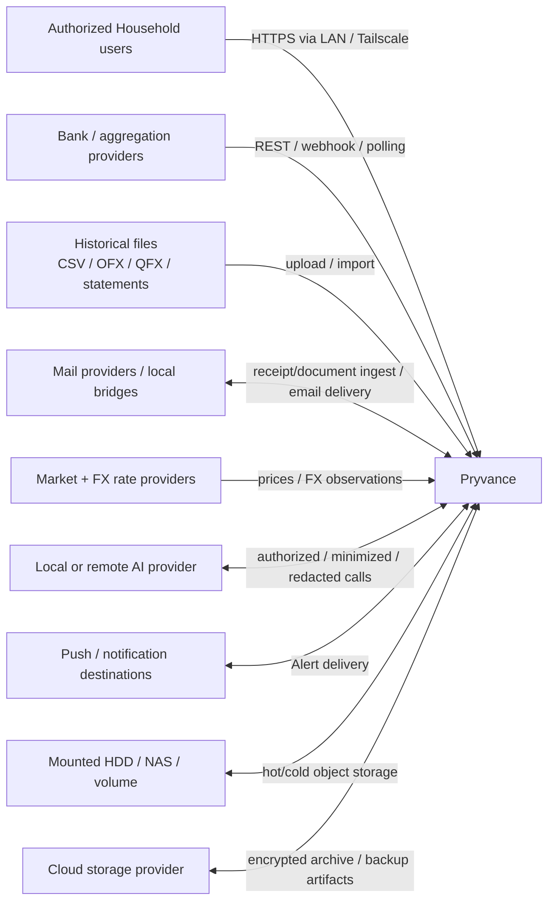
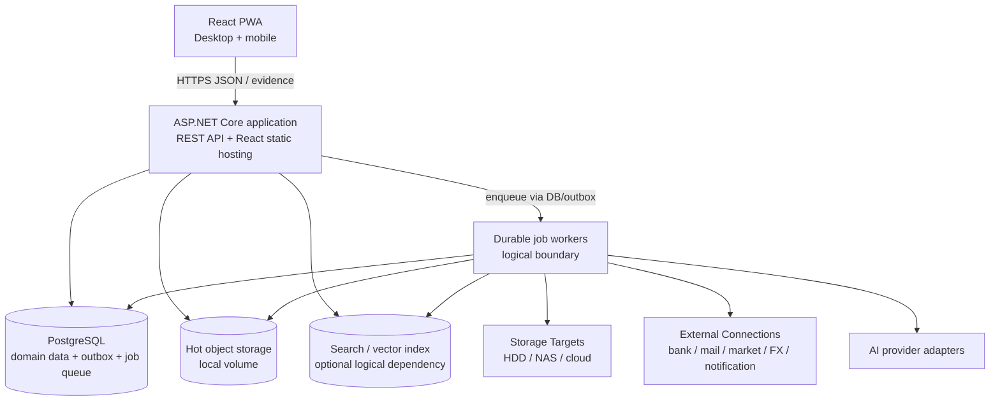
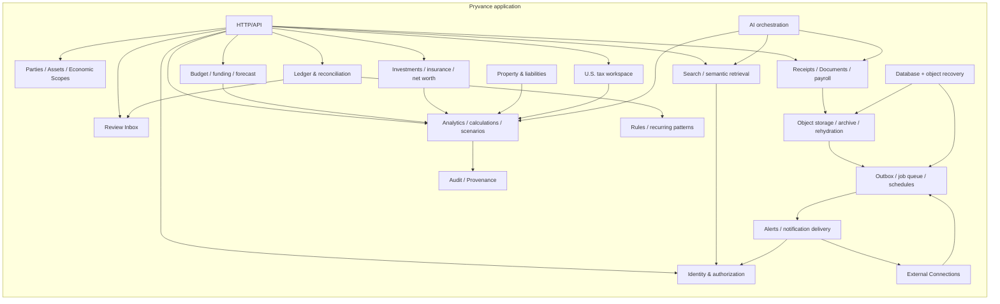
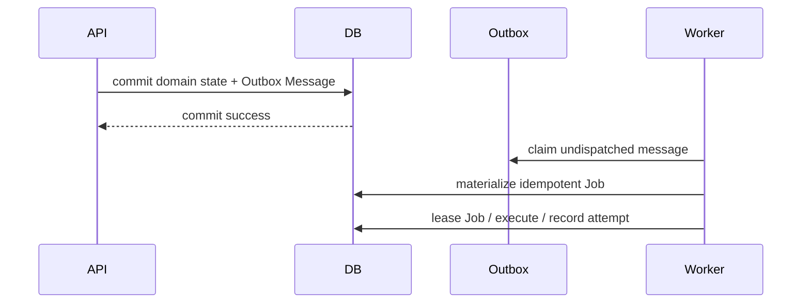
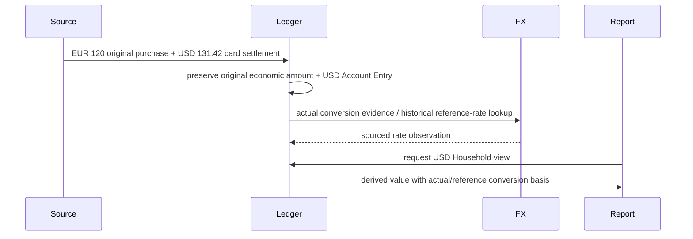
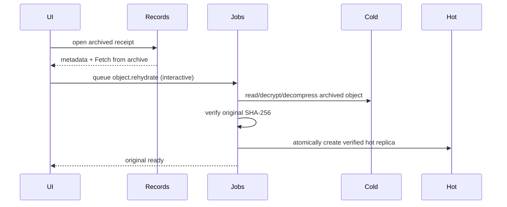
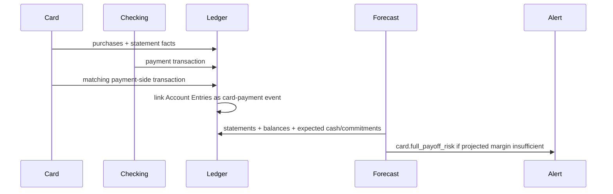
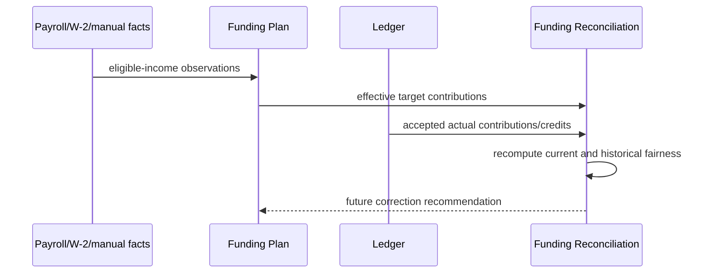
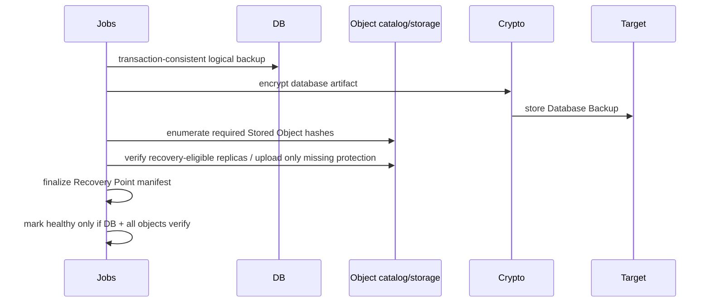

# Pryvance architecture

Kind: explanation

Pryvance is a self-hosted, local-first household financial platform. This design describes the intended feature-complete architecture approved so far; the roadmap only sequences when parts become operational.

The architecture favors one Household root per installation, immutable source evidence, explicit ownership/economic-scope/privacy boundaries, deterministic financial truth, durable asynchronous work, provider-neutral integrations, tiered document storage, optional AI, and independently verifiable encrypted database/object recovery.

## Context

One installation represents one Household, not a SaaS multi-tenant service. A Household can contain any number of People, Financial Entities, Accounts, Assets, liabilities, policies, tax filing contexts, plans, documents, and Economic Scopes.

External providers are sources, destinations, or computation dependencies rather than Pryvance's normalized financial system of record. Provider choice remains replaceable behind internal interfaces.

A Person can participate without connecting Accounts or exposing private detail. Shared planning, tax collaboration, and aggregate calculations therefore use explicit purpose-aware authorization rather than assuming Household-wide visibility.

Untrusted cloud storage receives only locally encrypted archive/recovery artifacts. Cloud/provider credentials never serve as content/recovery encryption keys.

## Container

Initial Docker Compose may run App and Worker in one ASP.NET Core process. PostgreSQL remains the durable work/state coordinator; a separate broker is not required initially. Worker loops may later move into one or more containers while keeping the same Job contract.

Hot object storage is normally a Docker volume on fast local storage. Additional configurable Storage Targets may be mounted filesystems/NAS/HDDs or external/cloud adapters. A target declares whether it can host hot replicas, cold Archive Packs, and/or disaster-recovery artifacts.

Search/vector infrastructure can remain embedded or absent until needed. PostgreSQL, search services, object storage and worker administration are not exposed directly to public networks.

## Component

### Identity and authorization

Owns User Identities, Household Memberships, guardian relationships, application roles, Visibility Policies, Tax Filing Context permissions, and purpose-aware authorization. A User Identity is not the same as a Person.

Authorization distinguishes detail visibility, aggregate inclusion, Household-calculation use, U.S. tax filing-context use, and mutation/administration. These checks apply before serialization, analytics, Review, search/indexes, AI context, Alerts, notifications, exports, autocomplete/counts, or evidence traversal.

### Parties, Assets, liabilities, and Economic Scopes

Party models actors: Person or Financial Entity. Asset models owned economic things such as real estate. Economic Scope is the allocation/planning/reporting target and may represent Household, Person, Financial Entity, or Asset.

Party→FinancialEntity, Party→Asset, Party→Account ownership and Party→Liability responsibility are effective-dated and independent. Entity ownership can be recursive but cannot cycle. Asset ownership does not automatically imply the same liability responsibility.

Net-worth traversal uses canonical economic items plus ownership/responsibility paths so an Asset visible directly and through an LLC is not double counted.

### Ledger and reconciliation

Owns immutable Source Records/Source Relationships, Financial Events, Account Entries, Financial Event Relationships, Reconciliation Links, balance observations, statements and statement reconciliation.

A Financial Event can have several Account Entries and currencies. Card payments and internal transfers link both Account sides without becoming spending. Refunds, reversals, reimbursements, fees and chargebacks can explicitly reference the event they correct/relate to.

### Money, FX, and time

Every native Money observation retains its currency. Cross-currency events can preserve original/economic amount, actual account settlement amounts, actual conversion facts, fees, and independent market/reference FX observations.

Household settings provide a default/home reporting currency; reports may override it. Actual settlement is preferred when it reflects the real reporting-currency cash impact; otherwise a sourced historical FX observation is used. Current foreign balances are revalued without changing native values.

Financial/business dates are preserved independently from UTC technical/knowledge instants and provider timezone metadata.

### Planning, funding, and calculations

Owns effective-dated Budget/Funding Plan versions, Contribution Targets, Funding Reconciliations, Commitments, Reserve Buckets, Savings Goals, Expected Cash Flows, short-range forecasts, scenarios, and Calculation Runs.

Funding fairness is not partner debt by default. A cumulative variance can remain informational, carry forward, alter future percentages, be corrected over time, reset, or explicitly convert to an Obligation.

Material derived results can reference Calculation Runs recording algorithm version, knowledge cutoff, plan versions, input/evidence manifest, reporting currency, assumptions and Coverage so prior recommendations are reproducible.

### Records and document vault

Original receipts/Documents are immutable content-addressed Stored Objects. Extracted Facts live in PostgreSQL separately from raw bytes.

Hot originals remain immediately readable. Storage policies can move old originals into bounded immutable Archive Packs on a mounted HDD/NAS or encrypted cloud target. Cold objects remain fully represented in the UI and can be rehydrated on demand through a durable interactive Job.

The archive representation never changes the Stored Object SHA-256 of the original bytes. Rehydration verifies that hash before creating a hot replica.

### External Connections

Connections expose capabilities such as Bank Data, Mail Read/Send, Cloud Storage, Market Data, FX Rates, AI inference and Notification Delivery. Authentication can use OAuth2, API key, app password, local bridge, certificates, or provider-specific mechanisms.

Least privilege is per capability; connecting Google Drive for archive/backup does not imply Gmail access.

### Alerts and notification delivery

Alerts are stable application facts defined by the Alert catalog. Domain modules emit Alerts; delivery preferences independently route them to in-app, push, email or future destinations.

Alert delivery minimizes sensitive content and re-evaluates recipient authorization where feasible.

### Jobs and schedules

All meaningful asynchronous work uses the durable PostgreSQL-backed Job queue. Producers are user/API commands, transactional outbox/domain events, provider triggers, or persistent schedules.

Workers claim expiring leases, respect priority/concurrency keys, record attempts, retry bounded transient failures, and retain sanitized terminal state. Interactive object rehydration can be higher priority than maintenance compaction; provider sync is serialized per connection; database backup and archive compaction are singleton within their safety scope.

### Recovery

Database and object recovery are independent streams:

- Database Backup: encrypted PostgreSQL logical backup plus catalog/schema metadata;
- Object Recovery: verified recovery-eligible replicas of every Stored Object referenced by the selected database snapshot.

A logical Recovery Point links both. A cold encrypted Google Drive replica may itself satisfy object disaster-recovery requirements; duplicate upload to a second object backup is optional. A local HDD/NAS cold copy may be useful live storage without satisfying offsite/failure-domain requirements.

## Dynamic view — durable job production

## Dynamic view — cross-currency card purchase

## Dynamic view — cold document rehydration

## Dynamic view — credit-card payoff risk

## Dynamic view — Household funding reconciliation

## Dynamic view — coherent recovery point

## Cross-cutting invariants

1. Source evidence and native monetary observations are never overwritten by interpretation/conversion.
2. Ownership, Economic Scope, liability responsibility, visibility, Coverage, and funding responsibility are independent dimensions.
3. Unknown Coverage never becomes zero.
4. Internal transfers/card payments/settlements do not become spending merely because cash moved.
5. Private data is authorized before every derived surface.
6. AI interprets but does not own arithmetic, authorization, source identity, reconciliation, cryptography, or tax treatment.
7. Important historical recommendations can be reconstructed through effective/knowledge time plus Calculation Run/Audit data.
8. Sealed Archive Packs are immutable and originals remain addressable by original content hash.
9. Cold storage and disaster recovery may share a target, but recovery eligibility/failure domain is explicit.
10. A Recovery Point is healthy only when its Database Backup and required object protection both verify.

Detailed persistence, storage, job and Alert contracts live in [`../reference/data-model.md`](../reference/data-model.md), [`storage-and-recovery.md`](storage-and-recovery.md), [`operations-and-jobs.md`](operations-and-jobs.md), and [`../reference/alert-catalog.md`](../reference/alert-catalog.md).
