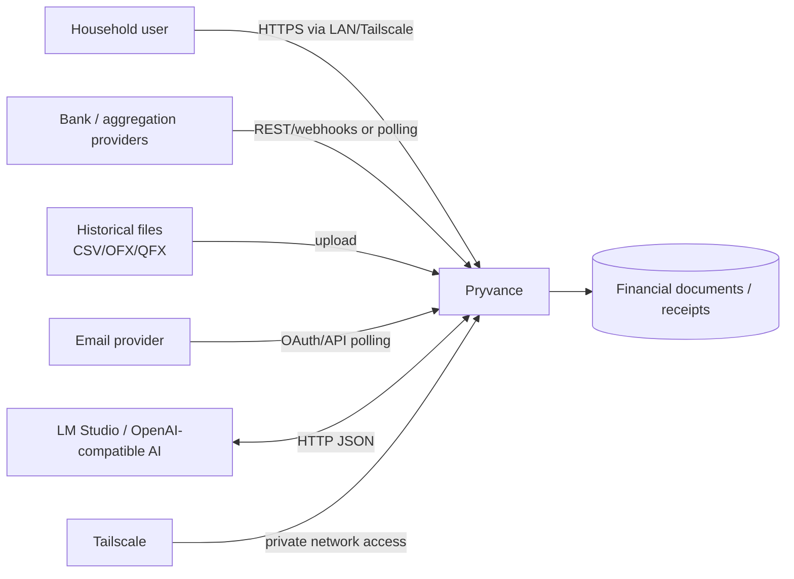
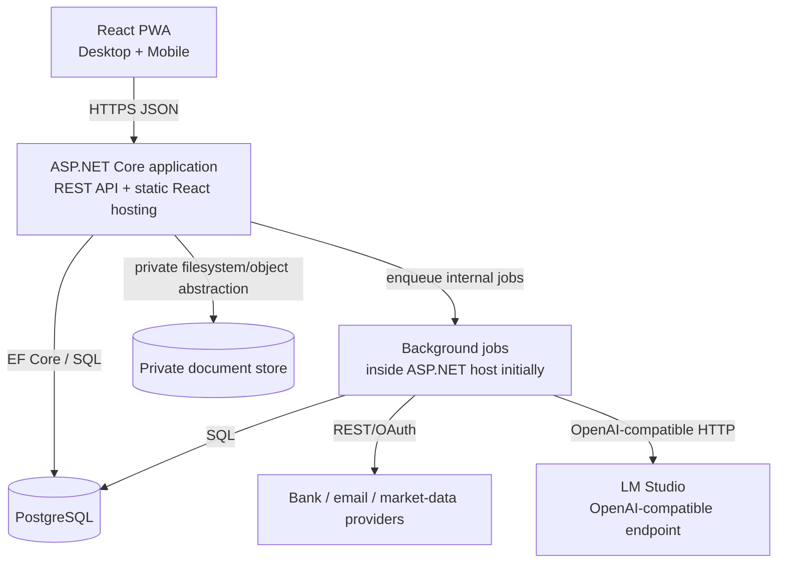
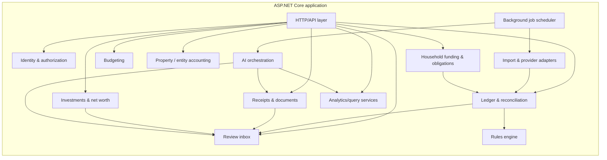

# Pryvance architecture

Kind: explanation

Pryvance is a self-hosted, local-first household financial platform. The initial architecture deliberately favors a small number of deployable units, strong domain boundaries inside the application, immutable source data, deterministic reconciliation, and optional local AI enrichment.

## Context

The user is the system owner and primary operator. Other household members may later have separate logins and selective visibility, but the financial model does not require every person to connect accounts. External providers are data sources, not systems of record. Pryvance remains useful when provider coverage is partial by combining provider sync, historical imports, manual facts, documents, and explicit coverage metadata.

## Container

Initial Docker Compose topology:

- `pryvance` — ASP.NET Core host serving the REST API, React static build, and background jobs.
- `postgres` — PostgreSQL; reachable only on the Docker network.
- persistent private storage volume — originals for receipts and documents, referenced by content hash.

React is compiled into static assets and served by ASP.NET Core. There is no required reverse proxy in the initial topology. Remote mobile access is expected to use Tailscale or an equivalent private overlay; public internet exposure is not an architectural requirement.

The background-job boundary is logical first. It can move to a separate worker container later if workload or fault isolation requires it without changing the domain interfaces.

## Component

### Identity and authorization

Owns application identities, household membership, guardian relationships, and visibility evaluation. Authorization distinguishes at least three questions: may the viewer see details, may data be included in aggregates, and may data be used in household calculations.

### Ledger and reconciliation

Owns immutable Source Records, normalized Financial Events, account activity, deduplication, pending-to-posted transitions, transfer/payment classification, evidence links, and deterministic matching. It never rewrites provider originals.

### Household funding and obligations

Owns Household Funding Plans, contribution targets, proportional/custom funding methods, Obligations, contribution credits, reimbursements, and Settlements. A personally funded shared expense remains unresolved until its disposition is chosen; it cannot simultaneously count as a contribution credit and an outstanding reimbursement.

### Budgeting

Owns year-specific budgets, category hierarchy, monthly defaults/overrides, YTD expectations, annual remaining budget, variance, and safe-monthly-spend calculations. Changing a future budget does not rewrite historical budgets.

### Investments and net worth

Owns investment accounts, holdings, investment activity, contribution facts, account/source coverage, valuation snapshots, and Known Net Worth. Cash transfers into investment accounts are not spending.

### Property and entity accounting

Uses Financial Entity parties and allocations rather than a separate accounting universe. Rental-property views are specialized reporting over the same Financial Events, Documents, Evidence, and ownership model.

### Receipts and documents

Stores immutable originals and extracted facts separately. Known financial forms may use deterministic, versioned extractors; AI is reserved for ambiguous recognition or interpretation. Every derived fact carries Provenance.

### Review inbox

Centralizes uncertain outputs across imports, ledger classification, receipt matching, extraction, household allocation, investment reconciliation, and AI suggestions. High-confidence deterministic results bypass Review; uncertain results become Review Items.

### Rules engine

Applies deterministic matching and normalization before AI. User corrections can create durable rules. Rules are inspectable, prioritized, and reversible.

### AI orchestration

Exposes narrow tools to a local OpenAI-compatible model. The model may interpret, classify, extract, summarize, and select among bounded options; application code performs arithmetic, reconciliation, authorization, and source-of-truth writes.

### Imports and provider adapters

Provider-specific clients map external records into Source Records. Provider choice is replaceable; domain code depends on internal ports rather than Teller, SimpleFIN, a bank API, email provider, or market-data vendor directly.

## Cross-cutting concerns

### Evidence before interpretation

Financial facts can be supported by multiple pieces of Evidence: provider transaction, receipt, email, statement, or user verification. Derived values never erase their source. Where possible, UI drill-down follows aggregate → Financial Event → Evidence → original artifact.

### Incomplete coverage is explicit

Analytics must distinguish absence of known data from a known zero. Account and scope coverage include date ranges and fact families. Household totals with incomplete member data use language such as `Known Net Worth` and expose what is included.

### Deterministic-first processing

The normal processing path is:

`source ingest → deterministic identity/deduplication → deterministic reconciliation → rules → AI enrichment when useful → validation → Review when uncertain → user correction → optional learned rule`.

### Deployment evolution

The initial monolith is a deployment choice, not a license to create an undifferentiated codebase. Domain modules communicate through explicit application interfaces. Separate worker, search/vector, or provider services may be extracted only when a measured operational need appears.
