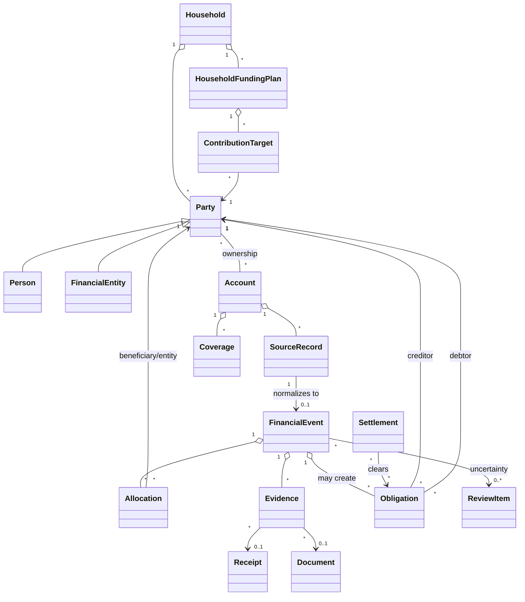

# Pryvance domain model

Kind: explanation

The domain model separates physical money movement from ownership, economic allocation, responsibility, evidence, and visibility. That separation is the basis for household finance without requiring every household member to merge all finances.

## Core relationships

## Aggregates and invariants

### Household

A Household is a collaboration and reporting boundary. It may contain any number of People and Financial Entities. A Person can exist with no connected Account. A child is a Person whose permissions may be managed by a guardian; the financial model does not treat children as a special transaction type.

### Party

A Party is the canonical actor in ownership and responsibility calculations. Person and Financial Entity are the two initial Party kinds. Future entities such as a trust or business should use the same ownership/allocation mechanics instead of introducing parallel transaction models.

### Account

Account records physical financial accounts and their ownership. Account ownership does not determine economic allocation. A personal Account can fund a Household expense, and a shared Account can fund an individual expense.

Account ownership supports percentages so joint ownership is expressible without assuming 50/50. Visibility is separate from ownership.

### Source Record

Source Records are append-only provider/file facts. Re-importing the same external record must be idempotent. A provider record has a provider/source identity when available; file-origin records carry file provenance and a deterministic fingerprint.

Source Records are never edited to reflect categorization, privacy, merchant normalization, or later interpretation.

### Financial Event

Financial Event is the normalized ledger concept. Initial roles:

- Expense
- Income
- Transfer
- Credit Card Payment
- Contribution
- Distribution
- Reimbursement
- Settlement
- Investment Activity
- Refund

Internal transfers and credit-card payments do not count as spending. Reimbursements and Settlements do not create new household income or expense.

### Allocation

Allocations answer dimensions independently:

- category/subcategory: what was the value for?
- beneficiary Party: who benefited?
- Financial Entity: what economic scope owns it?
- amount/percentage: how much of the Financial Event belongs to that allocation?

For each allocation dimension required by the event, component amounts must reconcile to the Financial Event amount within the currency's rounding tolerance.

### Obligation and Settlement

An Obligation is created when funding and final responsibility differ. Example: a personal Account pays a Household expense. The resulting Obligation remains open until one of the allowed dispositions occurs.

A qualifying personally funded shared expense may either:

1. remain an Obligation and later be reimbursed by a Settlement; or
2. be converted into an approved credit against a Household Funding Plan contribution target.

It cannot be both at the same time.

### Household Funding Plan

A Household Funding Plan is versioned by effective period. It includes shared obligations, savings/reserve targets, operating buffer, contribution method, eligible-income inputs, and Party-level targets.

Initial contribution methods:

- Equal
- Proportional to gross income
- Proportional to net income
- Custom percentages
- Fixed amounts
- Hybrid

Income used for contribution math can be manually supplied without exposing the source Account or payroll transactions.

### Budget

Budgets are independent from Household Funding Plans. A Budget represents planned spending/saving by category and Reporting Scope. Budget configuration is effective-dated so future changes do not rewrite historical expectations.

Annual category targets can derive monthly defaults with optional overrides. Reporting derives YTD expected budget, YTD actual, variance, annual remaining, and safe monthly spend for the remaining period.

### Evidence and Provenance

Evidence links a Financial Event or extracted fact to supporting source material. Evidence may include Source Records, Receipts, Documents, emails, statements, or user verification.

Provenance for derived facts includes source, extraction/matcher version, page/field when applicable, confidence when applicable, and verification state.

### Receipt

A Receipt is immutable original evidence plus separately stored extracted facts. Line items may be normalized, categorized, and assigned to Parties independently. Extracted line-item totals must be validated against receipt totals before high-confidence acceptance.

### Document

Document originals are immutable and content-hashed. Known forms use versioned deterministic schemas where possible; AI may assist recognition/extraction but does not redefine known financial field semantics.

### Review Item

A Review Item references the entity under question, reason, candidate/suggested resolution, confidence when applicable, evidence, and resolution state. Review is a shared mechanism across domain modules, not a transaction-only queue.

### Coverage

Coverage describes what Pryvance actually knows. It may apply to an Account, Party, Reporting Scope, provider, date interval, or fact family such as balance, holdings, transactions, cost basis, or contributions.

Unknown coverage never becomes a numeric zero. Reports based on incomplete coverage must label themselves accordingly.

## Privacy model

Visibility Policy answers separate permissions:

1. detail visibility — may this viewer see individual records and fields?
2. aggregate inclusion — may this data contribute to a summary shown to the viewer?
3. household calculation use — may this data be used to determine obligations/funding without exposing underlying details?

This supports balance-only retirement sharing, shared-transaction-only personal Accounts, private discretionary spending, and gifts that do not leak through placeholder rows.

## Derived reporting scopes

Reporting Scope initially supports Household, Person, and Financial Entity. It is a query boundary, not a different storage model. Rental-property reports, child spending, personal spending, and household summaries are projections over the same underlying Financial Events and Allocations.
