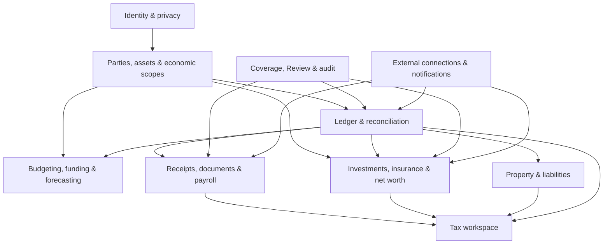
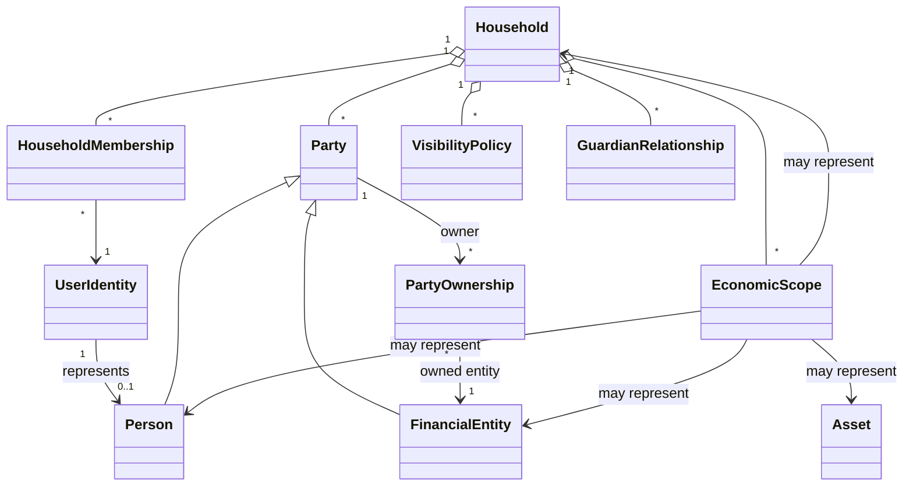
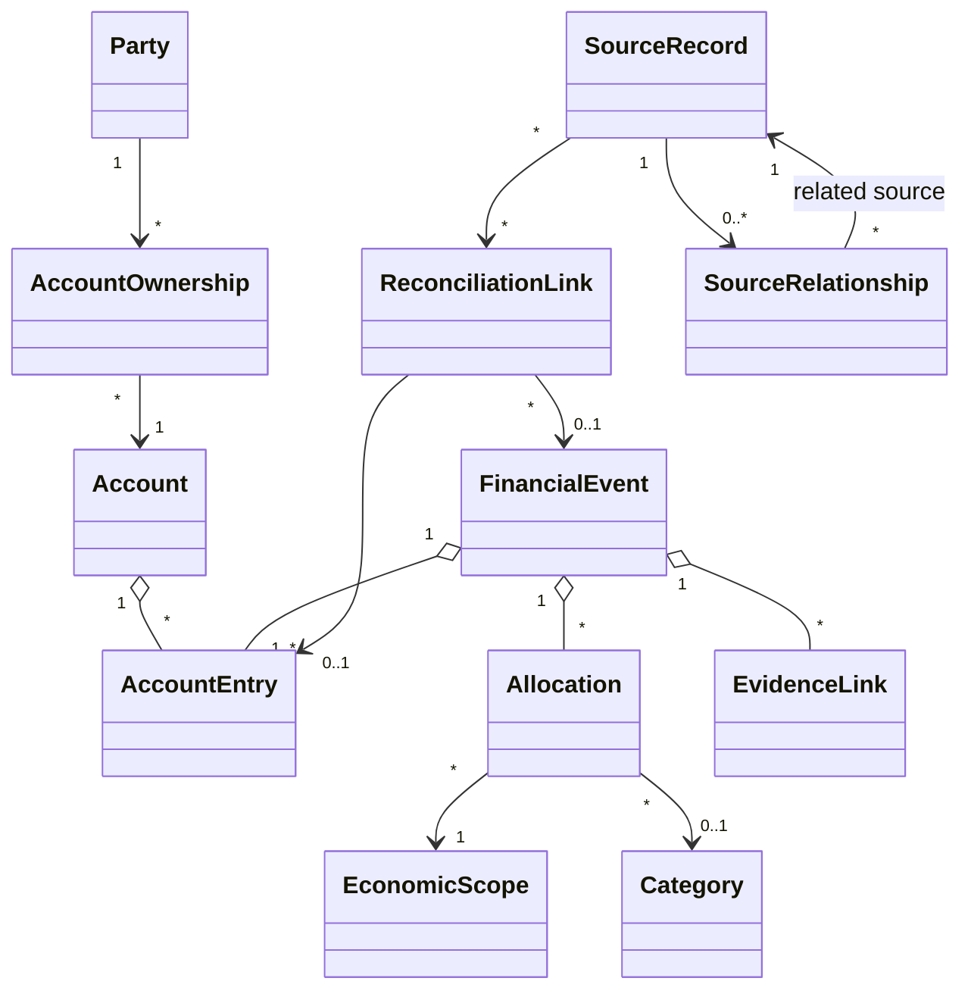
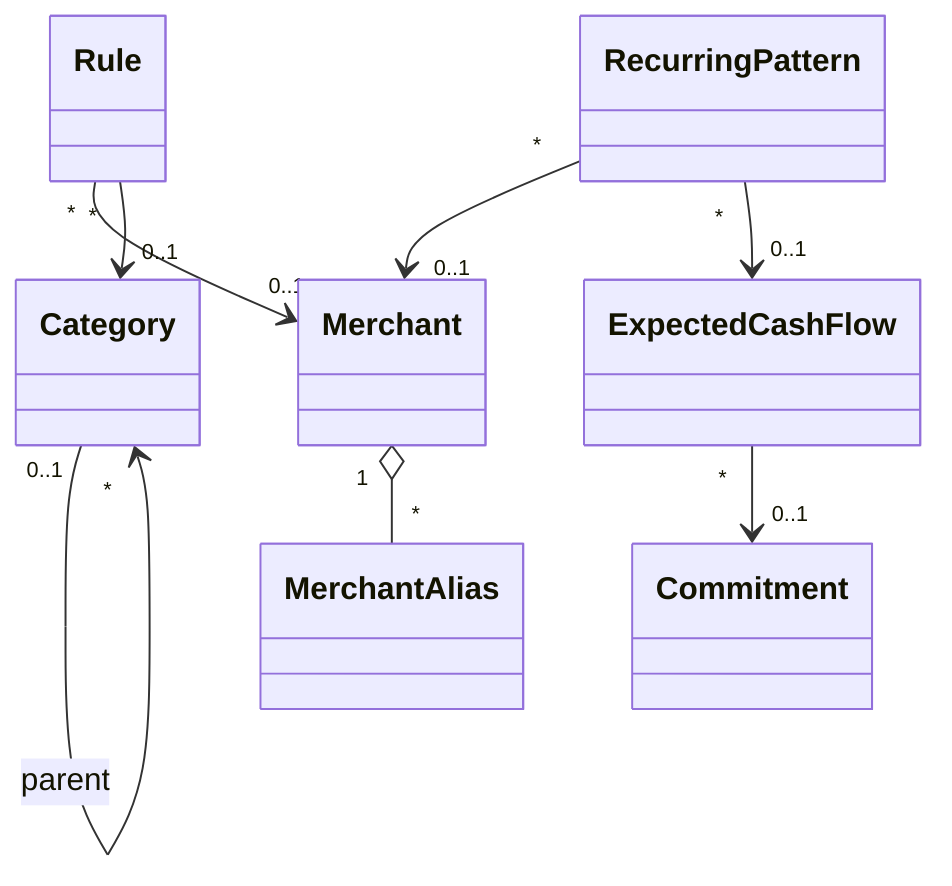
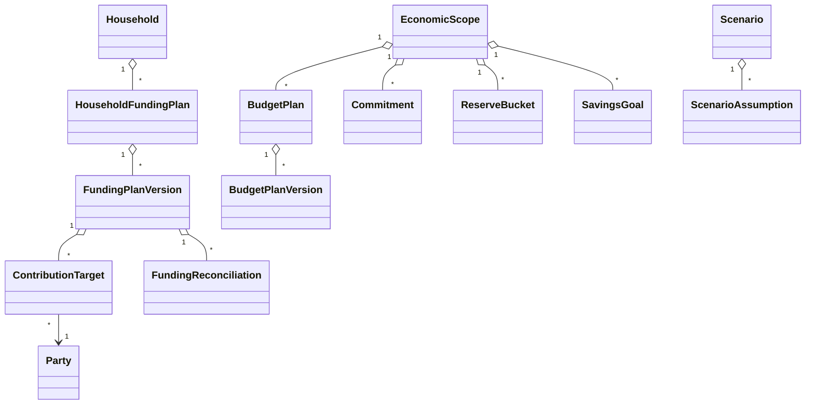
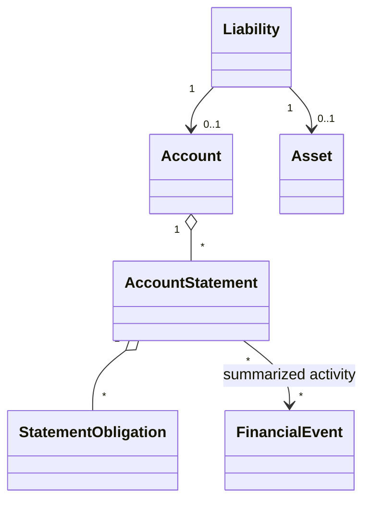
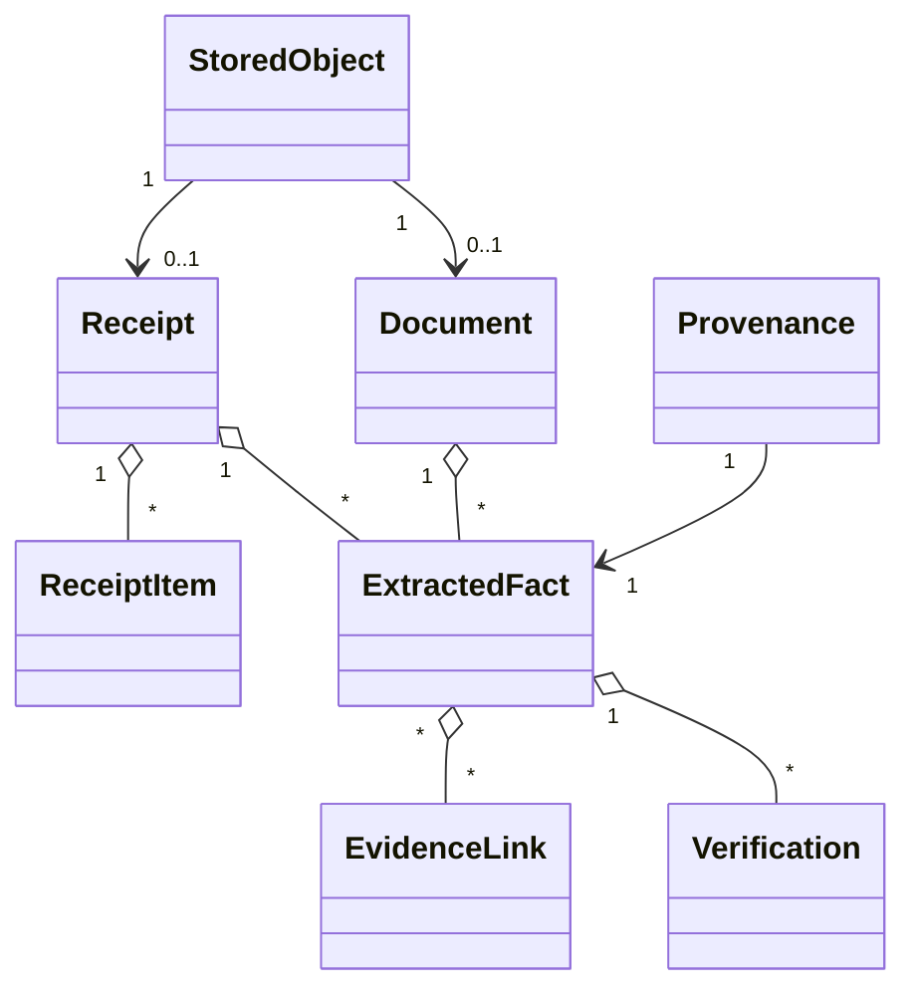
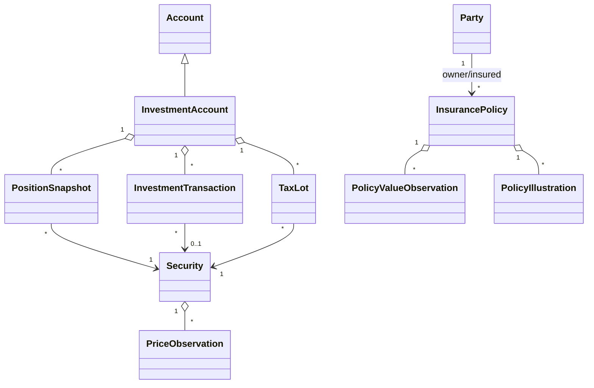
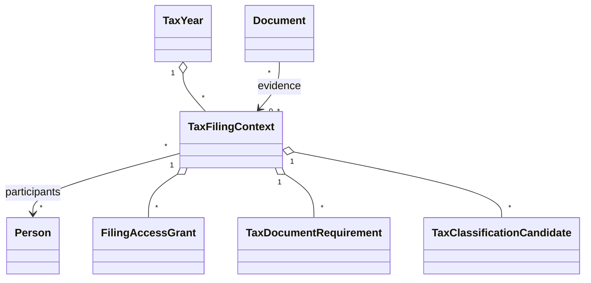

# Pryvance domain model

Kind: explanation

This domain model describes the intended feature-complete Pryvance product. Roadmap phases determine when portions are implemented; they do not narrow the target model.

The core design separates six questions that are often conflated in finance software:

1. **who or what owns something?**
2. **where did money physically move?**
3. **what economic scope did the value belong to?**
4. **what was the value for?**
5. **what responsibility/funding policy applies?**
6. **what evidence and permissions support what we know?**

## Domain map

## Identity, household and economic scope

### Household

A Household is the single collaboration root for one Pryvance installation. It groups People, Financial Entities, Economic Scopes, shared planning, filing contexts, and reporting. It is not a SaaS tenant abstraction; one installation intentionally represents one Household.

### User Identity and Household Membership

A User Identity is an authenticated application identity. It may represent a Person but is not itself a financial Party. Household Membership links identities to the Household and carries application roles such as Owner, Manager, Viewer, or Guardian.

Application Owner does not automatically bypass another Person's Visibility Policy. The trusted server/database administrator remains technically capable of inspecting plaintext in the initial security model; that is distinct from ordinary in-app authorization.

### Party

A Party is an actor that can own, fund, receive, contribute, or bear responsibility. Initial Party kinds:

- **Person** — adult or child, whether or not they have a login or connected account;
- **Financial Entity** — LLC, trust, business, or similar non-person actor.

Financial Entities may be owned by one or more Parties through effective-dated Party Ownership relationships. Recursive entity ownership is allowed, but ownership cycles are forbidden.

### Asset

An Asset is something of economic value, separate from the Party that owns it. Initial specializations may include:

- Real Estate Property;
- manually tracked tangible/intangible assets;
- other future asset types that need valuation/provenance.

An Asset may be owned by one or more Parties through effective-dated Asset Ownership relationships. A rental property is therefore an Asset even when an LLC owns it; it is not forced to masquerade as a Financial Entity.

### Economic Scope

Economic Scope is the canonical allocation/planning/reporting target. It may represent:

- Household;
- Person;
- Financial Entity;
- Asset.

This allows a transaction to be `for Household`, `for Alex`, `for Rental LLC`, or `for 123 Main Street` without conflating legal ownership with economic attribution.

An Asset or liability may be visible through multiple scopes. Aggregation deduplicates canonical economic items and follows ownership paths so the same underlying property is not counted once directly and again through its owning LLC.

### Guardian Relationship

Links a guardian Person/User Identity to a child Person and defines permitted management/view actions. Children use the same Person and Economic Scope concepts rather than special child-specific financial tables.

## Accounts, ownership and ledger

### Account

An Account represents a financial account such as checking, savings, credit card, mortgage, retirement, brokerage, custodial/529, policy loan, or manually tracked account-like balance source.

Account ownership is effective-dated and independent of:

- Economic Scope allocation;
- beneficiary;
- visibility;
- contribution responsibility.

A personal Account may fund a Household expense. A jointly owned Account may contain spending economically attributable to an individual. Ownership never substitutes for allocation.

### Source Record

A Source Record is an immutable observation exactly as obtained from an external provider, imported file, document extraction source, manual observation, or other ingestion channel.

It stores source identity, source type, observed/effective dates where relevant, raw or normalized provider payload references, import provenance, and deterministic fingerprinting information.

Source Records are append-only. Provider corrections, pending-to-posted transitions, or replacement data create new Source Records plus Source Relationships such as:

- supersedes;
- pending-posted pair;
- duplicate-of;
- correction-of;
- related-source.

Re-importing equivalent input is idempotent.

### Reconciliation Link

Links one or more Source Records to the Financial Event and/or Account Entry they support. This supports:

- both sides of a credit-card payment;
- provider record plus historical file overlap;
- pending and posted transaction versions;
- provider transaction plus receipt/email evidence;
- multiple statements supporting one normalized fact.

Reconciliation is deterministic wherever possible. AI does not own deduplication or source identity.

### Financial Event

Financial Event is the normalized economic event. Initial roles include:

- Expense;
- Income;
- Transfer;
- Credit Card Payment;
- Contribution;
- Distribution;
- Reimbursement;
- Settlement;
- Investment Activity;
- Refund;
- Fee;
- Interest;
- Adjustment.

An event may have one or more Account Entries. This provides double-entry-like linking where useful without requiring every economic allocation to become a formal accounting journal.

Examples:

- a card purchase has an entry on the card Account plus category/scope Allocations;
- a card payment links a checking outflow and card inflow as one payment event;
- an internal checking-to-savings transfer has two linked Account Entries and zero Household spending;
- a payroll deposit may be supported by pay-stub facts and a checking Account Entry.

Internal transfers and card payments do not count as spending. Settlements/reimbursements do not create new Household income/expense unless a separate true economic event exists.

### Account Entry

Represents the change observed in one Account as part of a Financial Event. Entries carry native Money, date, Account, direction/sign semantics, and reconciliation links.

The ledger must be able to detect an unmatched or missing opposite side of a known internal movement without fabricating one silently.

### Money and currency

Every Money value carries currency. Native source amounts are never rewritten by conversion. Household settings define one or more reporting currencies, with a primary/base currency.

FX Rate Observations carry currency pair, rate, effective date/time, source, and Provenance. Converted reports expose the conversion basis used.

## Categories, merchants, rules and recurrence

### Category

Categories form a validated hierarchy rather than unrelated Category/Subcategory IDs. A child category must belong to its parent; allocations cannot attach an incompatible subcategory. Categories may be selectable or grouping-only.

### Merchant / Counterparty

A canonical Merchant/Counterparty has aliases and normalization evidence. Rules and AI may propose canonicalization, but the raw Source Record description remains immutable.

### Rule

A deterministic, prioritized, inspectable action that may normalize merchant, assign category, suggest scope, identify transfers, or perform another bounded classification. Rules are testable against historical data before activation and are auditable/reversible.

### Recurring Pattern

Represents accepted recurrence such as salary, subscription, mortgage, insurance premium, utility, childcare, or other repeated cash flow. Patterns may initially be suggested by deterministic/anomaly/AI analysis but do not become forecast truth until accepted or deterministically defined.

Recurring state distinguishes:

- observed recurring pattern;
- Expected Cash Flow;
- contractual/planned Commitment.

This supports anomaly alerts such as missing expected pay, unusual amount changes, duplicate recurrence, or a forgotten subscription.

## Planning, funding and fairness

### Temporal plan model

Budget Plans, Funding Plans, eligible-income definitions, contribution percentages, ownership relationships, and other historically meaningful policy data use effective-dated versions.

Pryvance records both:

- **effective time** — when the fact/policy applies in the modeled financial world;
- **knowledge/audit time** — when Pryvance learned, changed, or recommended it.

This supports two different questions:

- "Using everything known today, what would the fair 2026 split have been?"
- "What did Pryvance recommend on June 1, 2026 using information known then?"

New historical evidence may cause retrospective analysis to change, but it does not erase the earlier recommendation or the evidence available at that time.

### Budget Plan

Represents planned spending/saving for an Economic Scope. Annual targets may have monthly defaults and month-specific overrides without requiring a row for every category/month combination.

Derived status includes annual target, expected through period, actual through period, variance, annual remaining, months remaining, and safe monthly spend. Budget changes create/effect versions; they do not silently rewrite what was planned for prior periods.

### Household Funding Plan

Defines how shared Household needs are funded while allowing each Person to retain individual accounts and discretionary money.

A Funding Plan Version includes:

- effective dates;
- shared Commitments;
- Reserve Buckets and Savings Goals to fund;
- operating buffer;
- contribution method;
- eligible-income definition;
- Party-level input facts/estimates;
- target percentages/amounts;
- correction policy.

Supported contribution methods include equal, proportional gross income, proportional net income, custom percentage, fixed amount, and hybrid.

Eligible income may come from payroll feeds, manual observations, tax documents such as W-2s, or other evidence permitted for Household calculation use. The underlying source detail need not be visible to other Household members.

### Funding Reconciliation

Tracks target contribution versus actual accepted contribution over time. It is the default mechanism for shared-spending fairness between Household partners.

A variance does **not** automatically create `Alex owes Jordan` debt. Correction policies may be:

- informational only;
- carry forward indefinitely;
- correct over N periods;
- adjust future contribution percentages;
- one-time corrective contribution;
- explicit conversion to an Obligation/Settlement;
- reset/forgive.

This supports annual reconciliation when new tax/payroll evidence becomes available. Example: a jointly filed W-2 may establish actual prior-year income, allowing Pryvance to recompute the fair prior-year split and recommend a new direct-deposit percentage effective from a chosen date, without routing all income through the joint account.

### Contribution

A contribution is accepted value supplied toward the Funding Plan. It may be a joint-account transfer/direct deposit or an approved shared-spending credit depending on plan policy.

The system may infer observed contribution behavior from Account Entries, but plan changes and correction policies remain explicit and auditable.

### Obligation and Settlement

Explicit Obligation remains available when the Household wants true debtor/creditor semantics, including non-spousal reimbursements or deliberately chosen direct settlement between partners.

Settlement reduces/clears an Obligation without creating new income or spending. Funding reconciliation and interpersonal obligation are separate concepts; the system never silently converts one into the other.

### Commitment

Represents money committed/expected for a known obligation such as mortgage, utility, insurance premium, childcare, tax payment, or card statement payoff.

Commitments participate in available-cash and forecasting calculations.

### Reserve Bucket

Represents money intentionally earmarked for a purpose while remaining in one or more physical Accounts: emergency reserve, maintenance, operating buffer, tax reserve, etc.

Reserve assignment does not create a new bank account. The same Account balance can be partitioned economically into multiple Reserve Buckets.

### Savings Goal

Represents a desired future balance/amount/date for purposes such as vacation, education/529 funding, major purchase, or longer-term Household objective. Goals may define target dates, priorities, contribution policies, and linked Accounts/Scopes.

### Actually free cash

For a selected scope/account set, free cash is derived deterministically from known liquid balances minus applicable near-term Commitments, funded Reserve Buckets, required contribution targets, and other configured holds. The exact horizon/assumptions are shown with the result.

### Scenario

Scenarios are isolated planning models over observed state plus Scenario Assumptions. They can cover days, months, years, or decades. Scenario outputs never mutate observed ledger truth.

Short-range deterministic forecasts answer questions such as credit-card payoff ability; longer-range scenarios answer questions such as property purchases, income loss, 529 funding, retirement changes, or major savings choices.

## Credit cards, statements and liabilities

### Credit-card statement model

A card statement may record:

- statement period;
- statement balance;
- minimum payment;
- payment due date;
- APR/grace-period facts where available;
- payments/credits after statement close;
- payoff status.

Statement facts combine with checking balances, Expected Cash Flows, Commitments, and planned spending to warn if projected liquidity risks inability to pay the statement in full or avoid interest.

### Liability

Liability is a canonical debt/economic liability independent of whether a provider exposes it as an Account. It may link to an Account and/or Asset. Examples include mortgage, loan, policy loan, security-deposit liability, or manually tracked liability.

## Evidence, documents and extracted facts

### Stored Object

Immutable content-addressed original file identified by cryptographic hash. User-controlled filenames are metadata, never trusted storage paths.

Original financial evidence is retained indefinitely by default. Retention settings may permit explicit deletion by class/age, with warnings that deletion removes source evidence and may not remove copies embedded in retained historical Backup Envelopes until those backups expire.

### Evidence

Evidence may support a Financial Event, Account Entry, Extracted Fact, valuation, match, Coverage assertion, or recommendation. Multiple independent pieces of Evidence may support the same fact.

### Extracted Fact

A structured fact derived from a Document, Receipt, Source Record, email, statement, or manual verification. It stores value, semantic field/schema, Evidence links, Provenance, verification state, and effective/knowledge dates where applicable.

### Provenance

Explains why Pryvance believes a fact. It records source identity, extractor/parser/matcher/rule/model version, page/field/region when applicable, confidence when applicable, and verification state.

Provenance is not Audit.

### Receipt and Receipt Item

Receipt retains immutable source image/PDF plus extracted merchant, date, subtotal, tax, tip, total, payment hints, and line items. Receipt Item supports quantity, unit/extended price, discounts/returns as required, normalized description, category allocation, and independent Economic Scope allocation.

Deterministic code validates arithmetic and transaction matching. AI may interpret ambiguous text but does not declare non-reconciling totals correct.

### Document

General financial evidence such as tax forms/returns, pay stubs, statements, leases, insurance policies/illustrations, mortgage records, invoices, closing documents, and other records. Known forms use versioned schemas where practical.

## Payroll and income facts

Pay stubs and payroll documents may produce structured facts for:

- gross pay;
- taxable wages by relevant definition;
- federal/state/local withholding;
- payroll taxes;
- pre/post-tax deductions;
- employee retirement contributions;
- employer contributions/match;
- benefits;
- net pay;
- pay period/date;
- employer.

Net pay may reconcile to a bank Account Entry. Payroll facts may feed funding-plan eligible-income calculations subject to Visibility Policy.

A W-2 or equivalent year-end tax document may provide better historical knowledge than the data available during the year. Pryvance can retrospectively recompute fairness while preserving what was known/recommended earlier.

## Investments and wealth

### Security / Instrument

Canonical tradable/investment instrument with identifiers, ticker where applicable, asset class, currency, and reference metadata. Security identity is independent of a provider-specific symbol.

### Investment Transaction

Includes contributions, employer contributions, buys, sells, dividends, interest, fees, distributions, rollovers, transfers, reinvestment, and supported corporate actions.

Transfers into investment accounts are savings/wealth movement, not Household spending.

### Position Snapshot and Price Observation

Position Snapshot records shares/units, value, source and as-of date. Price Observation stores instrument price, currency, source, timestamp/date, and Provenance.

### Tax Lot / Cost Basis

Tracked when source coverage supports it. Unknown or partial cost basis is explicit. Tax-lot or cost-basis facts may be document-derived when provider feeds are incomplete.

### Performance

Return calculations identify the methodology and coverage assumptions. Time-weighted return, money-weighted/XIRR, simple gain, income yield, or other metrics are only presented when required inputs are sufficiently covered. Missing history never silently becomes zero cash flow.

### Known Net Worth

Net-worth calculation traverses Accounts, Assets, liabilities, investment values, and economically realizable insurance values through ownership relationships. Canonical item IDs and ownership paths prevent double counting across Person/Entity/Asset scopes.

`Known Net Worth` is used when coverage is incomplete. Reports expose what is included, excluded, stale, or unknown.

## Insurance

Insurance Policy is a first-class record for Household coverage and, where applicable, economic value.

Initial policy types may include:

- whole life;
- universal/permanent life variants;
- term life;
- disability;
- long-term care;
- property/auto/umbrella or other coverage records.

General fields include owner, insured Party, beneficiaries, carrier, masked policy identifier, effective dates, premium schedule/history, status, coverage amounts, and Documents.

Permanent-life-specific facts may include:

- cash value;
- cash surrender value;
- death benefit;
- premiums/cost basis where known;
- dividend option/history;
- paid-up additions;
- policy loan balance/rate;
- guaranteed/non-guaranteed values;
- Policy Illustrations and annual projected values.

Current net worth may include an economically realizable value such as cash surrender value, not death benefit. Policy loans reduce attributable economic value and/or appear as liabilities according to policy semantics.

An accepted recurring premium or merchant classification without a linked Insurance Policy may create a suggestion to add/associate a policy.

## Property and rental accounting

Real-estate Property is an Asset specialization with address/location metadata, ownership, valuation observations, linked mortgages/liabilities, Documents, leases, insurance, taxes, and property-specific reporting.

Rental economic reporting distinguishes:

- rental income;
- operating expense;
- owner-funded expense/contribution;
- security-deposit liability;
- mortgage principal;
- mortgage interest;
- escrow/tax/insurance components where known;
- repair candidate;
- capital-improvement candidate.

Security deposits are liabilities unless/until an economic event changes their treatment. Mortgage payment components are not all expense. Repair vs capital treatment and other tax-sensitive classifications remain candidates until verified; AI never silently makes final tax treatment decisions.

## Tax filing contexts and workspace

### Tax Filing Context

A year-specific preparation context with mode:

- Joint;
- Individual.

A Joint context can authorize the designated preparer(s) to view tax documents required for the joint filing even when ordinary Person/account visibility is narrower. This is explicit filing-context access, not a global privacy override.

An Individual context may allow selected private tax facts to be used for Household calculations without revealing the Document or detailed fields to another Person.

### Tax workspace scope

Pryvance organizes and analyzes tax evidence; it does not prepare/e-file a tax return.

Capabilities include:

- expected-document checklist/completeness;
- W-2/1099/1098 and selected known-form extraction;
- receipt and document search for potential itemization/support;
- rental Schedule-E-style grouping;
- investment/tax fact organization where covered;
- candidate deductible/tax-treatment flags requiring verification;
- accountant/export package such as a ZIP of authorized tax documents and reports;
- AI companion queries grounded in authorized evidence.

Tax Filing Context governs both document visibility and exports.

## Visibility and privacy

Visibility Policy is independent of Party/Account ownership and Coverage. It evaluates at least:

1. detail visibility;
2. aggregate inclusion;
3. Household calculation use;
4. tax filing-context use/access;
5. mutation/management permission.

Useful policy presets may include Private, Balance Only, Summary Only, Shared Transactions Only, and Full Access, with record/document/fact overrides.

Private data must not leak existence or metadata through:

- transaction rows/placeholders;
- global search or semantic search;
- counts/autocomplete;
- Analytics;
- AI context/tool results;
- Review Inbox;
- notifications/scheduled insights;
- exports;
- evidence traversal;
- match candidate lists.

Gift/private-until-date semantics are represented as visibility policy/override state and are enforced across all derived surfaces.

Current authorization governs current access to historical details. Policy history is preserved for Audit but does not keep previously shared private history exposed after sharing is revoked.

## Coverage and observations

Coverage records what Pryvance actually knows for an Account, Party, Economic Scope, provider, date interval, or fact family. Examples:

- transactions;
- balances;
- holdings;
- price history;
- investment transactions;
- cost basis;
- contributions;
- payroll;
- policy values;
- property valuation;
- tax documents.

Coverage is separate from confidence. Unknown coverage never becomes a numeric zero.

Manual Observations are legitimate source facts with author, effective date, knowledge date and Provenance. This supports partial spouse participation, manually published balances/income, old insurance values, and other facts that are useful without full account connectivity.

## Review Item

A generalized unresolved uncertainty owned by the source domain module. Fields include referenced entity/fact, reason, candidate resolutions, Evidence, confidence where applicable, created/resolved timestamps, resolver, and resulting action/rule/pattern.

The product goal is a Review Inbox that can reach zero without forcing routine deterministic results through human review.

## Alert and notification

Alert is an application-domain event that may require attention or communicate an insight. It is separate from delivery. Examples include:

- cash-flow/credit-card payoff risk;
- funding shortfall;
- missing expected paycheck;
- forgotten/changed recurring charge;
- sync/provider failure;
- backup health failure;
- missing tax document;
- policy/statement anomaly;
- scheduled insight;
- Review backlog.

Notification Delivery adapters may send an Alert in-app, via PWA/Web Push, email, or future configured mechanisms.

## External Connection

Represents a configured external service connection. It stores provider, owner, authentication method, granted scopes/capabilities, credential reference, connection health, and verification state.

Capabilities include Bank Data, Mail Read, Mail Send, Cloud Storage, Market Data, AI, and Notification Delivery. Authentication is capability/provider specific: OAuth2, API key, local bridge, app password, certificate, or another supported mechanism.

Least privilege is required. A Google Drive backup grant does not imply Gmail access; Mail Read does not imply Mail Send.

## AI provider and redaction

AI Provider is provider-neutral. Local LM Studio is an expected deployment but not an architectural restriction.

AI requests are constructed through typed tools/schemas. Sensitive values are redacted by default, including SSNs, full account/policy numbers, access credentials, and other fields not semantically required. Stable placeholders may preserve relationships across a request, for example `<PERSON_2>` or `<ACCOUNT_4>`.

Authorization and redaction happen before data is provided to either local or remote AI. Remote-provider use requires explicit operator configuration and disclosure that selected authorized data may leave the local environment.

## Provenance versus Audit

**Provenance** answers: why do we believe this financial fact?

**Audit Entry** answers: who/what changed application state, from what to what, and when?

Audit Entry is append-only and covers mutable interpretations, plans, ownership, visibility, verification, rules, funding reconciliation decisions, retention settings, tax filing access, provider administration, and other security/financially material mutations.

Full event sourcing is not required.

## Backup domain

Backup Set contains a transaction-consistent database snapshot, referenced immutable objects, and versioned manifest. Backup Envelope is the locally authenticated/encrypted artifact sent to Backup Destinations. Recovery Secret is stored independently from provider credentials.

Restore verifies cryptographic authenticity, manifest completeness, hashes, application/schema compatibility, and object counts in isolated staging before live recovery is permitted.

## Global invariants

1. Source evidence is immutable; interpretation is mutable and audited.
2. Ownership, Economic Scope allocation, visibility, Coverage, and funding responsibility are independent dimensions.
3. Entity/Asset ownership graphs cannot contain cycles.
4. Canonical assets/liabilities/accounts are deduplicated in aggregate net-worth traversal.
5. Internal transfers, credit-card payments, settlements and reimbursements do not become spending merely because cash moved.
6. Funding variance between partners does not become interpersonal debt unless an explicit correction policy creates an Obligation.
7. Scenario data never mutates observed financial truth.
8. Unknown Coverage never becomes zero.
9. Private data is authorized before every derived surface, not merely hidden by UI.
10. AI is never authoritative for arithmetic, deduplication, authorization, reconciliation or tax treatment.
11. Native monetary amounts retain currency; conversion is an explicit derived view.
12. Historical effective state and historical knowledge state are both auditable/queryable.
13. Original evidence is retained indefinitely by default unless an explicit retention policy deletes it.
14. Backups are not considered healthy solely because upload succeeded.
