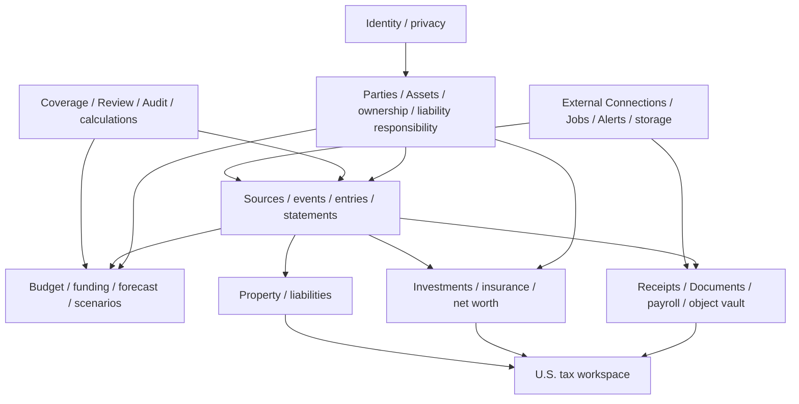

# Pryvance domain model

Kind: explanation

This domain model describes the intended feature-complete Pryvance product. Roadmap phases decide sequencing; implementation must not narrow these target semantics.

The design deliberately separates:

1. who owns an Account, Asset, entity or economic interest;
2. who is economically/legal-responsible for a Liability;
3. where money physically moved;
4. what economic scope/value purpose the movement belonged to;
5. what planning/funding policy applies;
6. what Evidence/Provenance supports a fact;
7. what a viewer is permitted to see/use;
8. what Pryvance knew and calculated at a particular time.

The detailed relational blueprint is in [`../reference/data-model.md`](../reference/data-model.md).

## Domain map

## Household, identity, Parties and Economic Scopes

A Household is the single collaboration root of one Pryvance installation.

A User Identity is an authenticated application identity and may represent one Person. Household Membership carries application role/status. A Person can exist with no User Identity or connected Account.

Party is the financial actor abstraction:

- Person;
- Financial Entity such as LLC, trust or business.

A Financial Entity can be owned by one or more Parties through effective-dated Party Ownership; entity ownership may recurse but cycles are forbidden.

Asset is a separately owned economic item such as real estate. Asset Ownership is effective-dated and separate from entity/Account ownership.

Economic Scope is the canonical allocation/planning/reporting target and may represent Household, Person, Financial Entity, or Asset. This permits `for Household`, `for Alex`, `for Rental LLC`, and `for 123 Main Street` without pretending all four are the same kind of actor.

The same underlying Asset may appear through multiple scopes; canonical item identity and ownership traversal prevent double counting.

## Account and liability ownership/responsibility

Account Ownership is effective-dated and independent of visibility, Economic Scope allocation, beneficiary, and funding responsibility.

Liability is the canonical debt/economic-liability concept even when a provider exposes it as an Account. Examples include mortgage, student loan, policy loan and security-deposit liability.

Liability Party Relationship records who is connected to the Liability and how:

- borrower/co-borrower;
- guarantor;
- economic bearer;
- other supported role;
- effective interval;
- optional economic share;
- legal-liability semantics where known.

Asset ownership never automatically defines liability responsibility. Two People can each be fully legally liable for a joint mortgage while the Household assigns a 50/50 economic share for net-worth/planning purposes.

## Source Records and reconciliation

Source Record is an immutable observation from provider, import, document-derived/manual input or other ingestion channel. Corrections/pending-to-posted/replacements create new records and Source Relationships rather than mutation.

Reconciliation Link associates one or more Source Records with the normalized Financial Event/Account Entry they support. Deterministic identity/deduplication runs before Rules/AI.

Manual observations use the same provenance model and are legitimate facts, not bypasses around source semantics.

## Financial Events and Account Entries

Financial Event represents normalized economic meaning. Initial roles include Expense, Income, Transfer, Credit Card Payment, Contribution, Distribution, Reimbursement, Settlement, Investment Activity, Refund, Fee, Interest and Adjustment.

A Financial Event can have one or more Account Entries. Each Account Entry is the native-currency change in one Account.

Examples:

- card purchase: one card Account Entry plus category/Economic Scope Allocations;
- card payment: checking outflow + card inflow linked as one event, no new spending;
- checking→savings: two linked entries, no spending;
- payroll deposit: checking entry supported by Payroll Record facts;
- cross-currency transfer: two native-currency entries plus FX conversion facts.

The ledger detects missing/unmatched expected opposite sides but never fabricates them silently.

## Financial Event Relationships

Relationships between normalized events preserve economic history beyond raw source links. Stable types include refund/partial-refund, reversal, chargeback, reimbursement, adjustment, fee and generic related-event relationships.

A partial refund can therefore point to the original purchase with an applicable Money amount. Budget/tax/category analytics can net/correlate it correctly without assuming merchant/date similarity forever.

## Money, FX and reporting currency

Money is amount plus native currency. Native source/account values never change when reporting currency changes.

A cross-currency purchase can preserve:

- original/economic purchase amount (for example EUR 120);
- actual account settlement (for example USD 131.42);
- actual implied conversion and bank/card fees;
- independently sourced historical reference FX Rate Observation.

Economically allocatable events use an explicit allocation basis/currency; the existence of several Account Entry currencies means Financial Event does not require one universal scalar amount.

Household settings define default/home reporting currency. A report may override it. Reporting uses actual settlement in the target currency when that is the appropriate observed economic cash impact; otherwise it uses a sourced rate for the financial/effective date. Current foreign balances are periodically revalued without mutating native balances.

Fx Rate Providers are adapters; OANDA or another provider can be configured later without changing semantics.

## Financial/business time

Pryvance preserves the financial/business date used by the source independently from technical instants such as posted/observed/knowledge time.

Instants are stored in UTC with source timezone metadata when supplied. Budget/month/year attribution normally uses the financial/business date rather than accidentally shifting the event because UTC falls on another calendar date. Household settings define display/schedule timezone.

## Statements and balance reconciliation

Account Balance Observation records sourced balance + currency + as-of time/date + Evidence/Provenance.

Account Statement is evidence for a statement period and can produce Statement Obligation facts such as card balance/minimum/due date.

Statement Reconciliation compares statement opening balance + reconciled activity with closing balance and records unexplained difference/status. Material differences create Review/Alert instead of being hidden.

This gives Coverage a stronger meaning than merely `we imported rows`: Pryvance can show when a ledger period actually reconciles to source balances/statements.

## Categories, merchants, Rules and recurrence

Categories form a validated hierarchy; child categories cannot be paired with an unrelated parent and grouping-only categories cannot be selected as leaf categories where policy forbids it.

Merchant/Counterparty is canonical identity plus aliases; raw source description remains immutable.

Rules are deterministic, inspectable, prioritized, testable and reversible.

Recurring Pattern distinguishes accepted recurrence from a one-off event. Expected Cash Flow is a future expected occurrence; Commitment is a stronger known/estimated required cash use. Suggested recurrence/anomalies do not become forecast truth until accepted/deterministically established.

## Planning, funding and fairness

Budget Plan and Household Funding Plan are distinct and effective-dated.

Budget Plan answers what a scope intends to spend/save. Funding Plan answers how Household shared Commitments, reserves, goals and buffer are fairly funded by contributing Parties.

Funding Plan versions include eligible-income definition, contribution method, target percentages/amounts and correction policy. Eligible income can come from payroll, manual facts or U.S. tax Documents permitted for Household-calculation use without exposing underlying private detail.

Funding Reconciliation tracks target contribution vs accepted cash/direct-deposit/shared-spending credits. Variance between partners is not debt unless an explicit correction policy deliberately converts it to an Obligation.

Correction can remain informational, carry indefinitely, correct over N periods, alter future percentages, request one-time contribution, reset/forgive, or explicitly create debt/Settlement semantics.

## Commitments, reserves, goals and Free Cash

Commitment represents expected/required cash use such as mortgage, premium, childcare, card statement payoff or tax payment.

Reserve Bucket earmarks liquid cash without requiring a separate Account. Savings Goal represents a desired future amount/date/priority.

Free Cash is a deterministic projection of liquid accessible balance after applicable Commitments, required contributions, protected reserves and configured goal funding for a stated horizon/assumption set.

## Credit cards and payoff risk

Credit-card Account Statements preserve statement period, balance, minimum, due date and APR/grace facts when available.

Payoff forecasting combines statement obligations, linked card/checking payment events, liquidity, expected income/spending, Commitments, reserves and plan contributions. Alerts distinguish full-payoff risk from minimum-payment coverage and never initiate payment autonomously.

## Effective time, knowledge time and Calculation Runs

Pryvance distinguishes when a fact/plan/ownership relationship applies from when Pryvance learned/verified/calculated it.

Important derived outputs can use Calculation Run to retain algorithm version, plan versions, `knowledgeAt`, reporting currency, input/evidence manifest, Coverage, assumptions and result references.

This allows both:

- `using everything known now, what would the fair 2026 split have been?`;
- `what did Pryvance recommend on June 1, 2026 and why?`.

Full event sourcing is not required.

## Evidence, Stored Objects and the vault

Original receipt/Document bytes are immutable Stored Objects addressed by SHA-256. Extracted Facts, Receipt Items and Provenance live separately in PostgreSQL.

A Stored Object may have hot and cold Object Replicas. Old originals may be packed into bounded immutable Archive Packs on a Docker-mounted HDD/NAS or encrypted cloud Storage Target. Rehydration restores a verified hot replica on demand.

Cold storage and disaster recovery can share a target. An encrypted recovery-eligible Google Drive cold replica can count as the document/object backup copy; a Household can instead configure local cold storage plus a separate offsite recovery copy.

Original evidence retention is indefinite by default. Retention deletion warns about Evidence/Provenance impact and historical Recovery Points that may still contain/refer to the object.

## Payroll

Payroll Record links structured gross/tax/deduction/benefit/employee-retirement/employer-contribution/net-pay facts to source evidence. Net pay can reconcile to a bank Account Entry and retirement contributions can reconcile to investment evidence.

Later W-2 evidence may refine prior-year eligible-income knowledge and Funding Reconciliation without erasing the original recommendation.

## Investments and Known Net Worth

Investment Accounts add Securities/Instruments, Investment Transactions, Position Snapshots, Price Observations and Tax Lots/cost-basis Coverage to the normal Account model.

Performance methodology and input Coverage are explicit; unsupported precision is not fabricated.

Known Net Worth traverses canonical Accounts, Assets, liabilities, investment positions and economically realizable insurance values through effective ownership/responsibility paths and deduplicates canonical items.

529/custodial/beneficiary ownership is modeled separately from beneficiary Economic Scope.

## Insurance

Insurance Policy is first-class even if it has no current asset value. General policies can track owner/insured/beneficiaries/carrier/status/premiums/coverage/Documents.

Permanent-life policies additionally support cash/cash-surrender values, death benefit, dividends/paid-up additions, policy loans, cost basis where known and Policy Illustrations. Death benefit is coverage, not current net worth. Actual-vs-illustration comparisons keep projections separate from observed value.

Recurring premiums with no linked Policy can generate an insurance-discovery suggestion.

## Property and rental accounting

Real Estate Property is an Asset specialization, not automatically a Financial Entity. A Financial Entity can own multiple Properties.

Rental reporting uses the shared ledger and distinguishes income, operating expense, owner-funded costs, security-deposit liability, mortgage principal, interest, escrow and repair/capital-treatment candidates.

Security deposits remain liabilities until an economic event changes treatment. Mortgage principal reduces liability rather than becoming expense. AI may suggest tax-sensitive classification but never silently finalizes it.

## U.S. tax workspace

The approved Tax workspace targets U.S. federal/state preparation support only; it does not model Japanese/EU/other tax filing systems and does not become tax-return preparation/e-filing software.

Tax Filing Context is year-specific, Joint or Individual. Joint filing can grant designated preparer access to required tax Documents without globally sharing unrelated finances. Individual filing can keep Documents private while selected facts participate in authorized Household calculations.

Capabilities include expected-document checklist, selected W-2/1099/1098 extraction, receipt/evidence search, Schedule-E-style organization, investment/payroll reconciliation, candidate tax classifications, accountant ZIP/export and evidence-grounded AI assistance.

## Visibility and privacy

Visibility Policy independently controls detail visibility, aggregate inclusion, Household calculation use, U.S. tax filing-context use and mutation permission.

Private data does not leak via transaction placeholders, counts, search, vector matches, Analytics, AI, Review, Alerts/notifications, Scheduled Insights, exports, evidence traversal or match candidates.

Current policy governs current historical access; policy history remains auditable.

## Coverage, Review, Alerts and operations

Coverage records what Pryvance actually knows by subject/date/fact family and never turns unknown into numeric zero.

Review Item represents uncertainty requiring human judgment; the product goal is a Review Inbox that can reach zero.

Alert is a stable product condition/insight separate from delivery. Core IDs/default semantics are defined in the Alert catalog.

Job is durable asynchronous work produced by user command, transactional outbox/domain state, provider trigger or persistent schedule. PostgreSQL queue semantics preserve leases, attempts, retries, priorities and concurrency.

## External Connections and AI

External Connections record provider, owner, authentication method, capabilities/scopes, secret reference and health. Capabilities include Bank Data, Mail Read/Send, Cloud Storage, Market Data, FX Rates, AI and Notification Delivery.

AI is provider-neutral, authorized/minimized/redacted before invocation, and constrained to typed application tools/structured outputs. Application code retains authority over financial truth.

## Recovery domain

Database Backup and Object Recovery are separate streams. A logical Recovery Point links the verified encrypted database artifact to an Object Recovery Snapshot proving every required Stored Object has a verified recovery-eligible replica.

Restore can reconnect cold archives and lazily rehydrate; it need not copy the lifetime vault back to primary storage immediately.

## Global invariants

1. Source evidence and native Money are immutable observations; interpretation/conversion is derived and auditable.
2. Ownership, Economic Scope, liability responsibility, visibility, Coverage and funding responsibility remain separate.
3. Financial Entity ownership graphs cannot cycle.
4. Net-worth aggregation deduplicates canonical economic items.
5. Internal transfers/card payments/settlements/reimbursements do not become spending merely because cash moved.
6. Funding variance does not become interpersonal debt unless explicitly converted.
7. Refund/reversal/reimbursement relationships remain linked to the events they affect.
8. Unknown Coverage never becomes zero.
9. Scenario state never mutates observed financial truth.
10. Private data is authorized before every derived surface.
11. AI is not authoritative for arithmetic, source identity, reconciliation, authorization, cryptography or tax treatment.
12. Native currency remains preserved; reporting currency is derived with explicit FX/settlement basis.
13. Financial/business date is distinct from UTC technical/knowledge time.
14. Important prior recommendations can be reproduced from effective/knowledge state plus Calculation Run/Audit data.
15. Sealed Archive Packs are immutable; rehydration verifies original hash.
16. A healthy Recovery Point requires both verified Database Backup and verified required-object recoverability.
