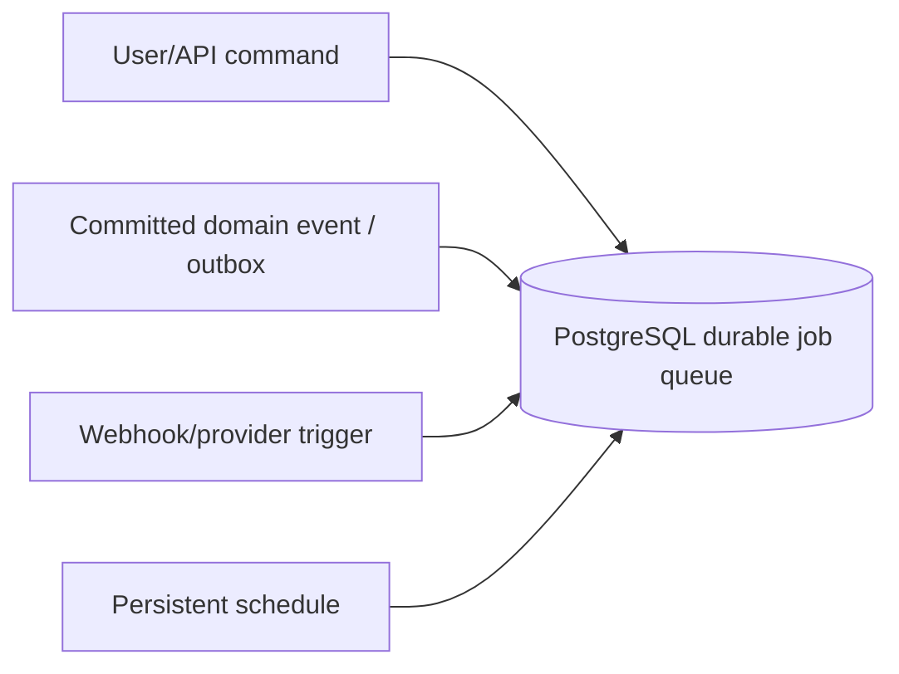
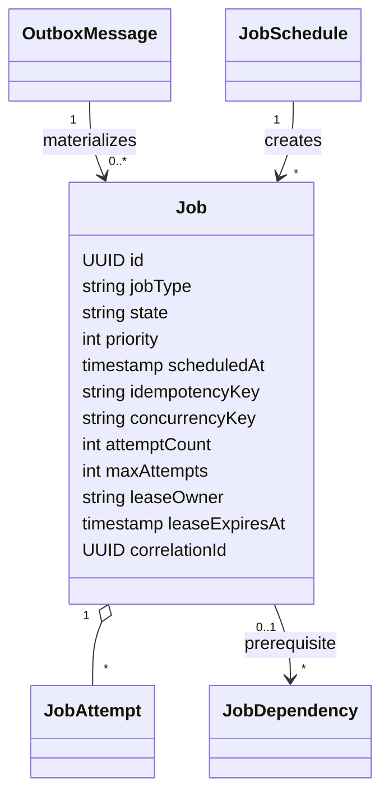
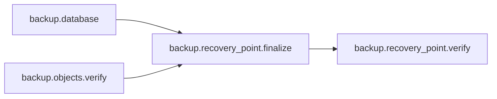

# Background jobs, scheduling, and execution

Kind: explanation

Pryvance performs substantial work outside the request/response path: provider sync, imports, document extraction, archive/rehydration, market/FX refresh, anomaly analysis, notifications, indexing, and recovery operations. These tasks use one durable job subsystem rather than ad-hoc timers or in-memory queues.

## Decision summary

The initial implementation uses PostgreSQL as the durable job queue and transactional outbox. Workers may run inside the ASP.NET Core process initially and move into one or more worker containers later without changing job semantics.

No Redis, RabbitMQ, Kafka, or separate broker is required for the initial target architecture.

## Producers

Jobs may be generated by four sources:



Examples:

- user clicks `Fetch from archive` → `object.rehydrate`;
- import commit → `ledger.normalize` / `ledger.reconcile`;
- bank webhook → `provider.sync`;
- nightly schedule → `backup.database` and object-protection verification;
- new Document → extraction/classification/index jobs;
- new price date → market/FX refresh;
- recurring schedule → anomaly scan or Scheduled Insight.

## Transactional outbox

When a database state change must cause asynchronous work, Pryvance commits the domain change and an Outbox Message in the same PostgreSQL transaction. A dispatcher materializes Jobs from committed outbox records.

This prevents the failure mode where application state commits successfully but the process crashes before the required job is enqueued.

Outbox dispatch is idempotent. An outbox record records dispatch identity/state but remains auditable after successful materialization.

## Job model



Job payloads prefer stable resource IDs and bounded parameters rather than embedding documents, provider secrets, AI prompts, or large financial payloads.

Core states:

- `queued`;
- `scheduled`;
- `running`;
- `retry_pending`;
- `succeeded`;
- `failed`;
- `cancelled`;
- optional `blocked` when explicit dependencies are incomplete.

## Leasing and crash recovery

Workers claim Jobs through a PostgreSQL lease. Claiming must support multiple workers without double execution; an implementation may use row locking such as `FOR UPDATE SKIP LOCKED` or an equivalent safe PostgreSQL pattern.

A running Job records lease owner, lease expiry, and heartbeat. If a worker/process/container dies, the lease expires and another worker may retry the Job according to retry policy.

Job handlers remain idempotent because leases reduce duplicate execution but cannot prove exactly-once effects across process/network failures.

## Priority

The target queue supports at least three logical priorities:

1. **Interactive** — user is directly waiting on the result, such as object rehydration or an explicitly requested import preview;
2. **Normal** — provider sync, extraction, notifications, reconciliation, routine analytical work;
3. **Maintenance** — archive compaction, bulk reindex, integrity sweeps, cleanup.

Priority affects claim order but does not bypass concurrency/safety restrictions.

## Concurrency

Parallelism is configured by Job type/resource rather than globally assuming all jobs are safe to run together.

A Job may define a `concurrencyKey` that acts as a logical mutex or bounded group.

Examples:

```text
provider-sync:<connectionId>       one sync for one connection at a time
backup-database:<installation>     singleton
archive-compact:<storageTargetId>  singleton per target
object:<storedObjectId>            avoid duplicate archive/rehydrate mutation
ai:<providerId>                    bounded by provider/model capacity
mail-ingest:<connectionId>         bounded per mailbox/provider
```

Representative target defaults:

| Job family | Parallelism intent |
|---|---|
| document/receipt extraction | bounded parallel |
| object rehydration | bounded parallel, interactive priority |
| provider sync | parallel across connections; serialized per connection |
| database backup | singleton |
| object-recovery verification | bounded/batched |
| archive packing | bounded by target; compaction serialized per target |
| market/FX refresh | batched parallel within provider limits |
| AI work | configured per provider/model |
| notifications | parallel with destination/provider rate limits |
| search indexing | batched parallel |

Worker-level concurrency and DB connection use are configurable so self-hosted installations can tune for available CPU/RAM/storage/provider limits.

## Dependencies and orchestration

Most Jobs are independent and small. Explicit dependencies are used when correctness requires ordering.

Example Recovery Point orchestration:



A parent/orchestrator Job does not imply a distributed workflow engine. Job dependencies, correlation IDs, and durable domain state are sufficient for the planned workload.

## Retry policy

Retryable failures use bounded exponential/backoff policy with jitter. Non-retryable validation/configuration errors fail immediately.

Retry policy may vary by Job type. For example:

- transient provider HTTP failure → retry;
- expired OAuth grant → fail/blocked + connection-auth Alert rather than hammer provider;
- malformed source Document → no blind retry; create Review/error state;
- hash mismatch during rehydration → fail + integrity Alert;
- insufficient disk space → fail/blocked + storage Alert.

Exhausted Jobs retain sanitized error metadata and generate an appropriate Alert where user/operator action is useful.

## Job attempts and diagnostics

Each execution attempt records:

- start/end time;
- worker identity;
- sanitized result/error classification;
- retry decision;
- progress/counters where useful;
- correlation ID;
- no secrets or unredacted document bodies.

Operational UI can show current/running/failed jobs without exposing raw provider/model payloads.

## Cancellation

Queued/scheduled Jobs may be cancelled when domain rules permit. Running cancellation is best-effort and handler-specific. Destructive or integrity-sensitive work completes an atomic safe unit before observing cancellation where required.

Cancelling a Job never automatically rolls back a committed financial fact unless the owning domain explicitly supports a compensating action.

## Schedules

Persistent Job Schedules generate jobs at configured intervals/times. Schedules use Household timezone for user-facing cadence but store execution instants in UTC.

Schedules include backup cadence, provider polling when required, price/FX refresh, anomaly detection, Scheduled Insights, storage lifecycle sweeps, integrity verification, and cleanup.

A schedule creates a durable Job; timers do not execute domain work directly.

## Core target job types

The catalog is intentionally extensible. Initial target families include:

- `import.parse`, `import.commit`;
- `ledger.normalize`, `ledger.reconcile`;
- `provider.sync`, `provider.webhook_process`;
- `mail.ingest`;
- `receipt.process`, `document.classify`, `document.extract`;
- `object.archive`, `object.rehydrate`, `archive.compact`, `storage.verify`;
- `fx.refresh`, `market.refresh`;
- `recurring.detect`, `anomaly.scan`;
- `ai.extract`, `ai.enrich`;
- `search.index`, `search.remove`;
- `notification.deliver`;
- `scheduled_insight.run`;
- `backup.database`, `backup.objects.verify`, `backup.recovery_point.finalize`, `backup.restore_test`;
- `retention.evaluate`, `retention.compact`.

Job type strings are stable product identifiers because alerts/operations/audit may reference them.

## Security and privacy

Authorization is evaluated when a user requests asynchronous work and again when results are delivered/exposed where permissions may have changed.

Job payloads do not become an alternate store of private financial/document content. Jobs reference authorized resources by ID; handlers load current permitted/internal data through application services.

External credentials are resolved at execution from protected secret storage and are never persisted into queue payloads/errors.

## Worker extraction

Initially:

```text
pryvance ASP.NET Core process
  HTTP/API
  job dispatcher
  worker loops
```

Later, if measured load requires it:

```text
pryvance-web
  HTTP/API

pryvance-worker x N
  same PostgreSQL queue
  same domain/application handlers
```

The database-backed leasing/concurrency model is designed so this deployment change does not require a new queue contract.
