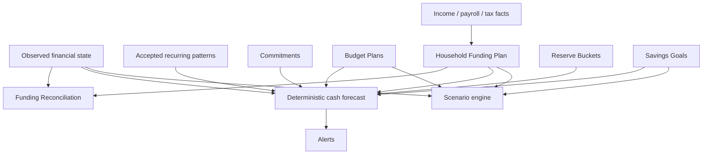

# Planning, funding, forecasting, and scenarios

Kind: explanation

Pryvance planning is designed around a Household that wants cooperation without forcing every Person's income and spending through one shared account. The system therefore distinguishes spending budgets, shared funding fairness, cash commitments, reserves, savings goals, forecasts, and hypothetical scenarios.

## Planning model



## Budget and funding are different

A Budget answers: **what do we intend to spend or save by category and Economic Scope?**

A Household Funding Plan answers: **how much shared money should each contributing Party supply, using what fairness rule, to cover shared commitments, reserves, savings, and buffer?**

They interact but are not the same object. A shared grocery budget may influence the required Household funding amount, but changing a contribution percentage does not rewrite the grocery budget.

## Budget Plan versions

Budget Plans are effective-dated. Each version contains annual category targets, default monthly amounts, optional month-specific overrides, and scope.

The common editing workflow remains simple:

```text
Groceries
Annual target: 12,000
Default monthly: 1,000
December override: 1,400
```

Pryvance derives the monthly series rather than requiring twelve manually maintained rows.

Status calculations include:

- annual target;
- expected through selected period;
- actual through selected period;
- variance to expected pace;
- annual remaining;
- remaining months;
- safe monthly spend for the remainder of the plan.

A new version never destroys the earlier effective plan. Reports can compare actual spending against either the policy that was actually in force or a later retrospective scenario.

## Household Funding Plan

A Funding Plan Version defines the shared operating requirement and its allocation among contributing Parties.

Inputs may include:

- known shared bills/Commitments;
- planned category spending;
- Reserve Bucket funding;
- Savings Goals;
- operating buffer;
- eligible-income facts;
- contribution method;
- correction policy;
- effective date.

Contribution methods include:

- equal;
- proportional gross income;
- proportional net income;
- custom percentages;
- fixed amounts;
- hybrid.

Eligible-income definitions are themselves versioned. A Household may choose gross pay, net pay, taxable wages, after-retirement pay, or another explicit formula.

## Privacy-preserving contribution fairness

A Person may publish or permit a fact for **Household calculation use** without granting access to the underlying payroll/account/document detail.

For example, a W-2 assigned to Jordan can establish an annual wage fact. If the Household files jointly, the Tax Filing Context may also grant the designated preparer access to the actual document. If filing individually, the funding engine can still use the authorized wage fact while the other Person cannot see the W-2 or detailed extracted fields.

This allows fair shared funding without requiring complete financial disclosure.

## Historical reconciliation and forward correction

Funding Reconciliation compares what a Party should have contributed under the selected policy with accepted actual contributions.

```text
Target contribution
- accepted cash/direct-deposit contribution
- approved shared-spending credits
= funding variance
```

The default interpretation of a variance between partners is **not debt**. Pryvance models it as cumulative funding fairness and applies the Funding Plan's correction policy.

Correction policies may:

- show variance only;
- carry it forward indefinitely;
- correct it over N periods;
- change future contribution percentages;
- request a one-time corrective contribution;
- explicitly convert a selected amount to an Obligation/Settlement;
- reset/forgive variance.

A typical yearly workflow may be:

1. Household operated during 2026 using estimated income percentages.
2. Tax documents later provide actual 2026 income.
3. Pryvance recomputes the 2026 fair split using the newly known facts.
4. Actual joint contributions are compared with the retrospective target.
5. The system recommends new percentages effective on a chosen 2027 date to gradually correct the cumulative variance.
6. The users adjust direct-deposit percentages once; Pryvance observes the new contribution behavior and continues reconciling.

All earlier recommendations and their information sets remain auditable.

## Accepted contribution recognition

Contributions may arrive through:

- direct deposit to a shared Account;
- transfers into a shared Account;
- explicit manual contribution;
- approved personally funded shared spending credit.

The funding engine can infer recurring contribution behavior from linked Account Entries, but inference does not silently change plan policy.

## Direct Obligations remain optional

Some situations genuinely require `A owes B`: non-spousal reimbursement, explicit loans, or a Household policy that deliberately uses direct settlement.

Pryvance therefore keeps Obligation/Settlement as a separate mechanism. Partners can opt into direct settlement for a particular case, but normal Household funding variance does not produce debtor/creditor language by default.

## Commitments

A Commitment is an expected or required cash use with amount/range, due date or recurrence, scope, priority, and source confidence.

Examples:

- mortgage payment;
- insurance premium;
- utilities;
- childcare;
- card statement payoff;
- quarterly tax payment;
- planned Household contribution.

Commitments can be known/contractual or estimated. Forecasts surface the distinction.

## Reserve Buckets

Reserve Buckets economically earmark cash without requiring separate physical accounts.

Examples:

- emergency reserve;
- home maintenance;
- rental maintenance;
- annual insurance/tax reserve;
- operating buffer.

A Reserve Bucket records target amount or rule, current funded amount, linked Economic Scope, and optional eligible Accounts. Transfers between physical Accounts do not change the reserve's economic purpose unless policy says they do.

## Savings Goals

Savings Goals represent desired future funding outcomes such as:

- vacation;
- 529/education funding;
- vehicle purchase;
- down payment;
- major home project;
- retirement contribution objective.

Goals may define target amount, date, priority, linked account/scope, and contribution rule. Forecasting can show whether the current contribution path reaches the goal.

## Free cash

`Free cash` or `actually free cash` is not simply an Account balance.

For a selected horizon/scope, Pryvance derives:

```text
liquid accessible balance
- near-term Commitments
- required Funding Plan contributions
- funded or protected Reserve amounts
- configured goal contributions / holds
= projected free cash
```

The result always exposes its horizon and assumptions. A user can therefore distinguish `checking balance` from `money safe to spend`.

## Recurring patterns and expected cash flow

Pryvance detects candidate recurring activity from ledger history. Suggested patterns are reviewed or accepted before they become trusted forecast inputs unless a deterministic provider/contract source defines them directly.

An accepted Recurring Pattern records:

- expected amount or tolerance;
- cadence/window;
- Merchant/Counterparty;
- Account/Economic Scope where useful;
- observed history;
- confidence/source;
- expected next occurrence.

Expected Cash Flow is the forecastable occurrence generated from an accepted pattern or explicit schedule.

## Forgotten recurring and anomalies

Recurring/anomaly analysis may surface:

- subscription still charging but no longer recognized/used;
- recurring bill amount increase;
- duplicate recurring service;
- expected paycheck missing;
- recurring income decrease;
- expected bill that stopped appearing;
- unusual frequency/date shift;
- card charge inconsistent with the accepted pattern.

A candidate anomaly may create an Alert and/or Review Item. AI may explain or cluster anomalies, but deterministic facts and accepted patterns drive the underlying calculations.

## Credit-card statement forecasting

Credit-card Accounts combine individual purchase activity with statement obligations.

A statement may provide:

- close date/period;
- statement balance;
- due date;
- minimum payment;
- APR/grace-period facts;
- credits/payments after statement close.

The card payment Financial Event links the checking Account Entry and card Account Entry so payment is not counted as expense again.

Payoff-risk forecasting combines:

- current card balance and statement due;
- scheduled/expected card purchases;
- checking/savings liquidity permitted for payoff;
- expected income;
- other Commitments;
- Reserve protections;
- planned Household contributions.

Examples of useful Alerts:

- projected checking cash falls below full statement payoff before due date;
- spending pace is likely to consume the payoff margin;
- only minimum payment is covered;
- an unmatched expected payment has not posted;
- statement balance remains unpaid near due date.

Pryvance can recommend a cash-flow action, but it does not autonomously move money unless a separate future payment automation feature is explicitly designed and authorized.

## Forecasting horizons

Pryvance does not hardcode one planning horizon.

### Deterministic short-range forecast

Primarily uses known balances, statements, Commitments, accepted recurrence, expected income, planned contributions, and near-term reserves. Appropriate for days to months.

### Scenario projection

Uses observed state plus explicit assumptions for months, years, or decades. Examples:

- one income disappears;
- salary changes;
- 529 contribution increases;
- rental property purchase;
- retirement contribution change;
- major home purchase;
- insurance-policy projection comparison.

## Scenario isolation

A Scenario has its own assumptions and projected results. It never mutates Source Records, Financial Events, Plans, Coverage, or observed valuations.

Scenario results identify:

- baseline snapshot/date;
- assumptions;
- calculation version;
- coverage limitations;
- currency/FX assumptions;
- output horizon.

A scenario may be promoted into a real future plan only through an explicit action that creates new effective-dated plan versions.

## Historical knowledge versus current knowledge

Pryvance must support both:

- **as-known-now analysis** — recompute prior periods with facts discovered later;
- **as-known-then audit** — reproduce the recommendation/calculation using only facts and plan versions known at that time.

This is important for annual funding fairness, tax-document discoveries, corrected investment history, late receipts, and retroactively supplied manual facts.

## Planning alerts and scheduled insights

Planning may generate Alerts for funding variance, upcoming reserve shortfall, goal slippage, credit-card payoff risk, unexpected recurring changes, or forecasted negative free cash.

Scheduled Insights are recurring analytical jobs that produce an Alert/Insight object first. Delivery through in-app, push, email, or future adapters remains a separate notification concern.
