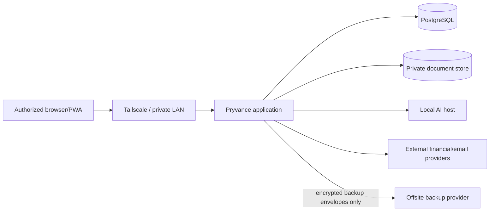

# Pryvance security and privacy model

Kind: explanation

Pryvance stores highly sensitive household financial data. The initial security posture assumes a trusted self-host operator, private-network access, least exposure, explicit application authorization, immutable source evidence, local AI by default, and encrypted offsite recovery.

## Trust boundaries

The Docker host and database administrator are trusted in the initial model. Application privacy controls protect household members from ordinary in-app disclosure; they do not claim cryptographic protection against a server administrator with direct database/filesystem access.

Offsite backup providers are explicitly not trusted with plaintext household data. A provider such as Google Drive receives only locally encrypted backup artifacts and transport metadata required to store them.

## Network posture

- PostgreSQL is not published outside the Docker network.
- Receipt/document storage is not served as a public directory.
- The application is intended for LAN or Tailscale access rather than direct public internet exposure.
- LM Studio/OpenAI-compatible AI endpoints are restricted to the LAN or tailnet and are not exposed broadly.
- TLS is provided by the private access layer or an optional future reverse proxy when needed.
- Backup-provider credentials use the narrowest practical access scope and are separate from backup encryption keys.

## Identity and authorization

The first deployment may have one operator identity, but the domain and API must not assume global visibility forever.

Authorization is evaluated independently for:

- viewing record detail;
- including private data in aggregates visible to another Person;
- using otherwise hidden data for a household calculation;
- modifying ownership, visibility, allocations, obligations, or verification state.

Private data must be filtered before serialization. UI hiding is not an authorization boundary.

## Visibility levels

Initial account-level presets may include:

- Private
- Balance only
- Summary only
- Shared transactions only
- Full access

Transaction/document overrides may be more restrictive. Gift/private transactions must not leak existence, merchant, date, or amount through placeholder rows unless the owner explicitly permits an aggregate that includes them.

## Sensitive data handling

- Do not log SSNs, full account numbers, access tokens, document bodies, receipt images, backup recovery secrets, or model prompts/results containing sensitive source material by default.
- Redact or omit fields not required for a model task before sending content to AI.
- Secrets are supplied through environment/secret mechanisms, never committed configuration.
- Full-disk encryption is a deployment requirement for real household data.
- Export and backup workflows must preserve ownership and visibility metadata.
- Plaintext backup artifacts must not be persisted outside controlled local staging; streaming directly into the encrypted backup envelope is preferred where practical.

## Encrypted backup and disaster recovery

Backups follow ADR-0007. The confidentiality boundary is client-side: encryption and authentication happen on the Pryvance host before any backup bytes are sent to Google Drive or another destination.

A Backup Set contains:

- a transaction-consistent PostgreSQL logical snapshot;
- immutable receipt/document objects referenced by that snapshot;
- a versioned manifest containing application/schema version, object identifiers, sizes, and cryptographic hashes.

The Backup Set is packaged into an authenticated Backup Envelope using a vetted encryption implementation or established backup/encryption engine. Pryvance does not define a custom cryptographic primitive.

Key separation is mandatory:

- the backup encryption/recovery secret is not the Google Drive/OAuth/provider credential;
- provider credential compromise must not decrypt existing backups;
- the recovery secret is never stored in plaintext next to the remote backup;
- complete host loss must be recoverable from the remote Backup Envelope plus the separately held recovery secret;
- losing the recovery secret makes the encrypted backups unrecoverable by design.

The product must provide a recovery-key export and verification workflow before encrypted offsite backup is considered fully configured. Suitable storage for that recovery material is outside Pryvance, such as a trusted password manager, offline encrypted media, or another independently protected location.

Restore is staged rather than in-place: download, decrypt, authenticate, verify every manifest hash, check format/schema compatibility, and only then permit recovery of database and immutable objects. A successful upload alone is not proof of recoverability; periodic restore verification is part of backup health.

Retention is configurable. Pruning only occurs after a newer backup is successfully created, uploaded, and verified; failure must never remove the last known-good backup. Provider-specific versioning or undelete capabilities are defense in depth, not substitutes for Pryvance retention logic.

Operational provider tokens, environment secrets, and local AI credentials do not need to be recoverable from the financial backup. A restored installation may require provider reauthorization, which avoids coupling disaster recovery to secret-export behavior.

## Document and receipt storage

Original files are immutable evidence and identified by cryptographic hash. Application records reference stored objects rather than using user-controlled filenames as paths. Downloads are authorized through application endpoints; storage paths are never directly exposed.

## AI boundary

AI is optional and untrusted for correctness.

- AI does not receive unrestricted database access.
- AI calls narrow application tools or receives bounded input selected by application code.
- AI cannot directly mutate system-of-record facts without application validation and authorization.
- Arithmetic, totals, deduplication, transfer matching, budget calculations, visibility enforcement, and known-form semantics remain deterministic application responsibilities.
- Low-confidence or non-reconciling AI output creates a Review Item.

## External provider tokens

Provider credentials/tokens are encrypted at rest when application-level secret storage is introduced and are never returned through general API representations. Provider webhooks, if adopted, require signature verification and replay protection.

Backup-destination credentials are treated the same way, but they are intentionally insufficient to decrypt Backup Envelopes.

## Threat priorities

1. accidental household-member disclosure;
2. public/network exposure of the service or database;
3. secret leakage through logs/configuration;
4. malicious or malformed document/import content;
5. AI prompt/data leakage;
6. silent corruption of financial truth through automation;
7. backup loss, remote deletion, or unencrypted backup exposure;
8. loss of the separately held recovery secret.

## Future cryptographic privacy

Client-side/per-user encryption could protect private records even from the server administrator, but it conflicts with server-side search, analytics, reconciliation, AI, and recovery. It is explicitly deferred until a household member requires that stronger guarantee. The current schema should avoid assumptions that would make a later encrypted-private-record envelope impossible.
