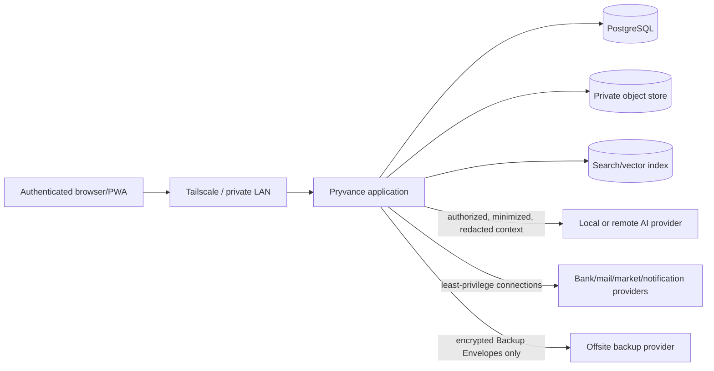

# Pryvance security and privacy model

Kind: explanation

Pryvance stores highly sensitive household financial, tax, identity, insurance, property, and document data. This document describes the intended feature-complete security/privacy architecture. Roadmap sequencing does not weaken these target guarantees.

The target posture assumes a trusted self-host operator and host administrator, authenticated application users, private-network access by default, least-privilege external connections, explicit application authorization, immutable evidence, provider-neutral AI with redaction, auditable exports/changes, and encrypted offsite recovery.

## Trust boundaries



The Docker host, OS administrator, and database administrator are trusted in the initial cryptographic model. In-app privacy protects Household members from ordinary application disclosure; it does not claim that a server administrator with direct database/filesystem access cannot inspect plaintext.

Future client-side/per-user cryptographic privacy may strengthen that boundary, but it is not required for the current feature-complete product vision.

## Network posture

- PostgreSQL is not published outside the internal container network.
- Document/receipt storage is not exposed as a public directory.
- Search/vector services, when present, are internal dependencies and not directly exposed.
- The application is intended for LAN/Tailscale or equivalent private-overlay access rather than direct public internet exposure.
- TLS is provided by the private access layer or a configured reverse proxy when required.
- Local AI endpoints are restricted to the LAN/tailnet.
- External connections use outbound provider communication; inbound provider webhooks require explicit endpoints, authentication/signature validation, replay protection, and narrow routing.

## Authentication

Every installation containing real Household data requires application authentication even if initially only one User Identity exists.

User Identity is separate from Person. A Household member may exist as a Person without a login, and a login may have administrative responsibilities independent of financial ownership.

Target roles include:

- **Owner** — installation/Household administration;
- **Manager** — delegated operational management;
- **Viewer** — permitted read access only;
- **Guardian** — delegated actions for a child Person.

Roles do not replace fine-grained Visibility Policies.

Being application Owner does not automatically grant ordinary in-app access to another Person's private financial detail. Administrative host access is a separate trusted-operator capability outside normal application authorization.

## Authorization dimensions

Authorization evaluates purpose as well as object ownership. At minimum:

1. **detail visibility** — may this user see individual records/fields/evidence?
2. **aggregate inclusion** — may this data contribute to a summary visible to the user?
3. **Household calculation use** — may selected facts be used for funding/fairness/planning without exposing their source details?
4. **Tax Filing Context use** — may the data/document participate in a Joint or Individual filing context, and may the designated preparer see it?
5. **mutation/management** — may the user change plans, ownership, visibility, verification, rules, exports, connections, or administrative settings?

Private data is filtered before serialization and before every derived surface. UI hiding is never an authorization boundary.

## Visibility policies

Useful account-level presets may include:

- Private;
- Balance Only;
- Summary Only;
- Shared Transactions Only;
- Full Access.

Record/document/fact overrides may be more restrictive. Gift/private-until-date controls are visibility-policy state, not presentation tricks.

Current authorization governs current access to historical detail. If sharing is revoked today, previously shared historical transaction detail is no longer exposed through ordinary application views. Policy history remains in Audit for accountability.

## Privacy propagation requirement

Authorization must be applied before data reaches:

- REST responses;
- dashboard aggregates;
- deterministic analytics;
- global search;
- search/vector indexes and snippets;
- autocomplete/counts/facets;
- Review Inbox;
- match candidate lists;
- evidence traversal;
- AI tool results/context;
- Scheduled Insights;
- Alerts/notifications;
- exports/download packages;
- background caches/materialized projections.

A private transaction must not leak existence through a placeholder row, count, merchant suggestion, Review item visible to another user, notification, semantic match, or AI explanation.

Derived artifacts inherit the privacy classification/purpose restrictions of their sources unless an explicitly authorized aggregate/calculation result is designed to reveal less-sensitive output.

## Household calculation without disclosure

Pryvance intentionally supports facts that may be used in Household calculations while remaining hidden in detail.

Example: a Person may keep payroll and W-2 documents private but authorize an annual eligible-income fact for Funding Plan calculations. Another Household member can see the resulting fair contribution percentage or funding status without seeing the underlying wages, employer details, deductions, or source Document unless a separate authorization grant applies.

The calculation engine receives only the minimum facts necessary for the calculation.

## Tax Filing Context privacy

Tax collaboration is explicit and year-specific.

### Joint filing context

A Joint Tax Filing Context names participants and designated preparer(s). It may grant the preparer access to the tax Documents/facts required for joint preparation even when ordinary financial visibility is narrower.

This grant is scoped to the filing context. It does not automatically expose unrelated personal transactions/accounts.

### Individual filing context

Each Person's tax evidence remains private unless otherwise shared. Selected facts may still be authorized for Household calculation use without exposing the source document/detail.

### Export

Accountant/tax-preparer exports are generated from an explicit Tax Filing Context and are audited. The export includes only authorized Documents/facts/supporting evidence and does not silently package the entire Household vault.

## Sensitive-data handling

Do not log or expose by default:

- SSNs/tax IDs;
- full account/card numbers;
- full policy identifiers where unnecessary;
- access/refresh tokens;
- API keys;
- backup Recovery Secrets;
- provider credentials;
- document bodies/images;
- model prompts/results containing sensitive source data;
- unredacted private exports.

Secrets are supplied through environment/secret mechanisms or encrypted application secret storage, never committed configuration.

Full-disk encryption is required before real Household data is considered safely onboarded.

Temporary plaintext used for parsing/restore is restricted to controlled local staging and removed promptly. Streaming into encrypted/output-safe processing is preferred where practical.

## External Connection security

External Connection stores provider, authentication method, granted scopes/capabilities, encrypted credential reference, owner, and health.

Capabilities are independent:

- Bank Data;
- Mail Read;
- Mail Send;
- Cloud Storage;
- Market Data;
- AI Inference;
- Notification Delivery.

Least privilege is mandatory. A cloud-storage grant for backups does not imply mail access. Mail Read does not imply Mail Send.

Supported authentication mechanisms may include OAuth2, API key, local bridge, app password, certificate, or provider-specific mechanisms. The architecture does not assume every provider behaves like Google OAuth.

Provider credentials:

- are encrypted at rest when persisted;
- are never returned through general API representations;
- are never sent to AI;
- are never included in normal financial backup requirements;
- may require reauthorization after disaster recovery;
- produce sanitized health/error state only.

Provider webhooks, when used, require signature verification/replay controls as supported.

## AI security boundary

AI is provider-neutral and correctness-untrusted.

Local LM Studio/OpenAI-compatible inference is an expected default, but the operator may explicitly configure a remote provider. Remote use requires clear disclosure that selected authorized data may leave the local environment.

### Authorization before AI

AI never sees data first and asks permission later. Application authorization filters scope and purpose before any tool result or prompt context is constructed.

### Redaction/minimization gateway

Sensitive values are redacted by default before AI requests, including:

- SSNs/tax IDs;
- full account/card numbers;
- full policy/account identifiers;
- access tokens/credentials;
- Recovery Secrets;
- other identifiers not required for the task.

Stable placeholders may preserve semantic relationships in one request, for example:

```text
<PERSON_2>
<ACCOUNT_1>
<REDACTED_TAX_ID>
```

A feature that requires an original sensitive value must explicitly declare that requirement, pass authorization, and surface the privacy consequence.

### Constrained tools

AI cannot receive unrestricted SQL or database credentials. It uses typed application tools whose authorization cannot be widened by model-supplied parameters.

AI cannot directly own:

- arithmetic/totals;
- deduplication;
- transfer/payment reconciliation;
- authorization;
- budget/funding calculations;
- net-worth deduplication;
- backup cryptography;
- known-form semantics;
- tax treatment;
- source-of-truth mutation without deterministic validation.

Low-confidence/non-reconciling output becomes a candidate fact or Review Item.

## Search and embeddings privacy

Search indexes are derived sensitive data. Privacy must be enforced at indexing and query time.

Private records cannot leak through:

- indexed title/snippet;
- counts/facets;
- autocomplete;
- vector nearest-neighbor output;
- embedding-derived semantic similarity;
- AI retrieval context.

Embeddings inherit source visibility and retention semantics. Revoked/deleted sources trigger index update/removal as required by the policy.

## Evidence and document security

Original files are immutable evidence and content-hashed. Application records refer to object IDs/hashes rather than using user-controlled filenames as filesystem paths.

Binary access is through authorized application endpoints. Storage paths and raw object locations are never directly exposed.

Uploads/imports are untrusted input:

- validate type/size;
- avoid executing embedded content/macros;
- use safe parsers;
- prevent path traversal;
- isolate temporary processing;
- handle malformed files without leaking parser internals/sensitive context.

## Retention and deletion

Original evidence is retained indefinitely by default.

A configured retention policy may allow deletion by class/age, but deletion is explicit and audited because it weakens evidence/provenance.

Deletion from the live system does not imply immediate erasure from older retained Backup Envelopes. The UI/API must disclose that historical recovery points may continue to contain the object until backup retention expires.

## Audit versus provenance

Provenance records why Pryvance believes a financial fact.

Audit records who/what changed application state, when, and relevant before/after references.

Audit includes security/financially material actions such as:

- visibility changes;
- ownership changes;
- plan/version changes;
- verification/corrections;
- rule/pattern changes;
- Funding Reconciliation correction decisions;
- tax filing access grants;
- exports;
- External Connection changes;
- remote AI enablement/configuration;
- retention settings;
- backup/recovery administration.

Audit is append-only and excludes raw secrets.

## Encrypted backup and disaster recovery

Backups follow ADR-0007. Encryption/authentication occurs locally before any bytes are sent to Google Drive or another destination.

A Backup Set contains:

- transaction-consistent PostgreSQL logical snapshot;
- immutable objects referenced by that snapshot;
- versioned manifest with application/schema version, object identifiers, sizes, and hashes.

The Backup Set is packaged into an authenticated Backup Envelope using a vetted encryption implementation or established backup/encryption engine. Pryvance does not invent cryptographic primitives.

### Key separation

- backup Recovery Secret is not provider/OAuth credential;
- provider credential compromise cannot decrypt existing backups;
- Recovery Secret is never stored in plaintext beside remote backups;
- complete host loss is recoverable from Backup Envelope + separately held Recovery Secret;
- loss of Recovery Secret makes the encrypted backups unrecoverable by design.

The operator must export and verify recovery material before offsite backup is considered fully configured.

### Restore verification

Restore uses isolated staging:

1. download envelope;
2. authenticate/decrypt;
3. verify manifest/hash completeness;
4. check application/schema compatibility;
5. verify object/database counts/health;
6. only then permit live recovery.

Upload success alone is not proof of recoverability. Periodic restore testing is part of backup health.

### Retention safety

Pruning occurs only after a newer recovery point is successfully created, uploaded, verified, and satisfies policy. Failure never deletes the last known-good recovery point.

## Multi-currency privacy/integrity

Native amounts/currencies are immutable facts. FX conversion is derived and sourced. Reports identify the rate/source/date used so conversion cannot silently rewrite historical native values.

## Alerts and notification privacy

Alerts contain the minimum detail required for the configured recipient/channel. Notification rendering re-evaluates recipient authorization at delivery time where feasible.

A push/email alert should prefer wording such as `Credit-card payoff risk detected` over exposing merchant/account/private amount details when the delivery channel is less trusted or the recipient lacks detail permission.

## Threat priorities

1. accidental/misconfigured Household-member disclosure;
2. unauthorized Tax Filing Context access/export;
3. public/network exposure of app/database/internal services;
4. secret leakage through logs/configuration/backups;
5. remote AI or integration over-sharing;
6. search/index-derived privacy leakage;
7. malicious/malformed import/document content;
8. silent corruption of financial truth through automation/AI;
9. provider webhook/replay/spoofing issues;
10. backup loss, remote deletion, or unencrypted backup exposure;
11. loss of separately held Recovery Secret;
12. stale/revoked credentials or abandoned integrations continuing to access data.

## Future cryptographic privacy

Client-side/per-user encryption could protect selected private records even from the trusted server administrator. That is not required for the current target because it complicates server-side search, analytics, reconciliation, AI, tax collaboration, and recovery.

The schema should avoid assumptions that would make a future encrypted-private-record envelope impossible, but current documentation must not imply that this stronger guarantee already exists.
