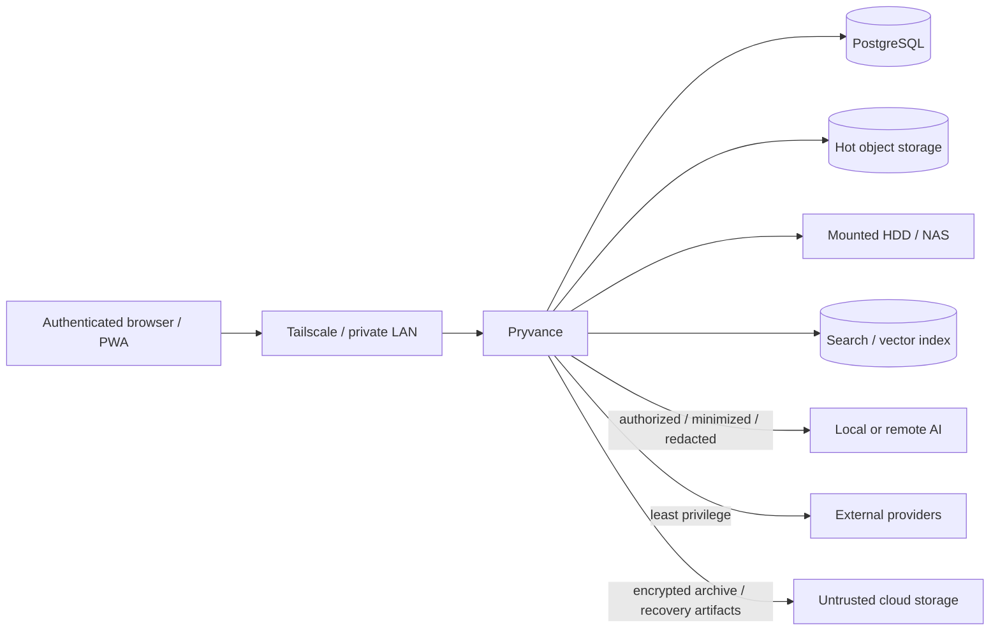

# Pryvance security and privacy model

Kind: explanation

Pryvance stores highly sensitive Household financial, tax, identity, insurance, property and document data. This document describes the feature-complete security/privacy target; roadmap sequencing does not weaken these guarantees.

The target assumes a trusted self-host operator/host administrator, authenticated application users, private-network access by default, purpose-aware authorization, least-privilege External Connections, encrypted secrets, immutable evidence, constrained/redacted AI, durable auditable background work, and encrypted offsite recovery.

## Trust boundaries

The Docker host, OS administrator and database/storage administrator are trusted in the current cryptographic model. In-app privacy protects Household members from ordinary application disclosure but does not claim protection from a server administrator with direct plaintext access.

A configured local NAS/HDD may be treated as trusted local storage according to deployment policy. External/cloud Storage Targets are not trusted with plaintext unless the operator deliberately changes the trust model; target architecture requires local authenticated encryption for untrusted/cloud archive and backup data.

## Network and authentication

- PostgreSQL, internal storage, search/vector services and worker administration are not directly public.
- Remote application access is intended through LAN/Tailscale or an equivalent private overlay.
- TLS is provided by the private access layer or configured reverse proxy.
- Provider webhooks use explicit endpoints with signature/authentication/replay controls where available.
- Every installation containing real Household data requires application authentication.

User Identity is separate from Person. Target roles include Owner, Manager, Viewer and Guardian, but roles do not replace resource/purpose Visibility Policy. Being application Owner does not automatically bypass another Person's private-detail policy through ordinary application APIs.

## Purpose-aware authorization

Authorization evaluates at least:

1. detail visibility;
2. aggregate inclusion;
3. Household calculation use;
4. U.S. Tax Filing Context use/preparer access;
5. mutation/management/administrative permission.

Current policy controls current access to historical detail. Revoking sharing removes ordinary historical access; prior grants remain only in Audit.

Authorization occurs before data reaches REST output, aggregates, deterministic analytics, search/indexes, autocomplete/counts/facets, Review, match candidates, evidence traversal, AI tools/context, Calculation Runs visible to another user, Alerts/notifications, Scheduled Insights, exports, or caches/materialized projections.

Private data must not leak existence through placeholder rows or secondary metadata.

## Household calculation without disclosure

Selected private facts may be authorized for Household calculations without exposing their source detail. For example, annual wages extracted from a private W-2 can inform Funding Reconciliation while another Person sees only the allowed contribution/fairness result.

The calculation engine receives only facts permitted for that purpose. Calculation Run/Audit data visible to another user must not disclose hidden input values simply because it records provenance internally.

## U.S. tax filing privacy

Tax Filing Contexts are year-specific and target U.S. federal/state preparation support.

A Joint context can explicitly authorize designated preparer access to tax Documents/facts required for joint preparation even if ordinary financial sharing is narrower. An Individual context keeps tax evidence private unless separately shared, while selected facts may still be authorized for Household calculation use.

Accountant/tax exports are explicit, scoped, audited, and contain only authorized materials.

## Sensitive data and secrets

Do not log/expose by default:

- SSNs/tax IDs;
- full account/card/policy identifiers;
- access/refresh tokens and API keys;
- provider/AI credentials;
- Recovery Secrets/content-encryption keys;
- raw document bodies/images;
- unredacted private AI prompts/results/exports.

Operational Jobs reference resource IDs rather than copying documents/secrets into queue payloads. Workers resolve credentials at execution through protected secret storage.

Secrets are never committed to the repository. Full-disk encryption is required before real Household data is considered safely onboarded.

## AI boundary

AI is provider-neutral and correctness-untrusted. Local inference is expected but not mandatory.

Authorization filters the resource/purpose before prompt/tool construction. Sensitive values are removed or replaced with stable placeholders by default, including tax IDs, full account/card/policy numbers, credentials and recovery material.

Remote provider enablement requires explicit operator disclosure/opt-in that authorized minimized data can leave the local environment.

AI receives typed tools/structured schemas rather than unrestricted SQL. It cannot directly own arithmetic, deduplication, authorization, transfer reconciliation, plan math, net-worth deduplication, tax treatment, storage cryptography, or unvalidated source-of-truth mutation.

## Search and embeddings

Search/vector indexes are derived sensitive data. Authorization is enforced at indexing and query time. Private items cannot leak via title/snippet, counts/facets, autocomplete, nearest-neighbor results, similarity scores or AI retrieval context.

Revocation/retention deletion triggers required index cleanup. Search indexes/previews are rebuildable and need not be treated as authoritative backup content when they can be reconstructed.

## Object vault and tiered storage

Original Stored Objects are content addressed by SHA-256 and immutable. Domain metadata/extracted facts remain separate in PostgreSQL.

Hot/cold movement creates/removes Object Replicas; it does not change the canonical Stored Object hash or extracted facts.

Cold Archive Packs are immutable after sealing. Rehydration decrypts/decompresses in controlled staging, verifies the original SHA-256, and only then atomically creates a hot replica.

Untrusted/cloud cold storage uses locally authenticated encryption. Archive/content-encryption keys are independent of provider credentials and recoverable through a vetted key-wrapping/envelope mechanism tied to separately held Recovery Secret material. Pryvance does not invent cryptographic primitives.

A cloud cold target may simultaneously satisfy object disaster-recovery requirements. Local cold storage on the same host/failure domain must not be mislabeled as offsite protection.

## Upload/parser security

Uploads/imports are untrusted input. Pryvance validates size/type, prevents path traversal, avoids executing macros/embedded active content, uses safe parsers, isolates temporary processing, and sanitizes parser errors.

User-controlled filenames are metadata only; they never determine filesystem paths.

## Retention and deletion

Original evidence is retained indefinitely by default. Configurable deletion is explicit/audited because it weakens Evidence/Provenance.

Deleting an object from live retention does not imply immediate erasure from immutable Archive Packs or older retained Recovery Points. Reclaimable archive entries are removed through safe compaction only after replacement/protection rules permit it; historical recovery artifacts persist until their own retention expires.

## Durable job security

PostgreSQL Jobs/Outbox records are application infrastructure, not a second financial data store. Payloads are bounded, sanitized and ID/reference oriented.

Workers use expiring leases, idempotent handlers and type/resource concurrency limits. Attempts record sanitized errors; failures can create Alerts without leaking provider/document/model content.

Persistent schedules use Household timezone for user cadence and UTC instants for execution/audit.

## External Connection security

Capabilities are independently granted: Bank Data, Mail Read, Mail Send, Cloud Storage, Market Data, FX Rates, AI Inference and Notification Delivery.

A Drive/cloud grant does not imply mail access. Mail Read does not imply Mail Send. OAuth2 is one possible mechanism among API keys, app passwords, local bridges, certificates and provider-specific authentication.

Provider credentials are encrypted at rest, never returned through general API representations, never supplied to AI, and may require reauthorization after disaster recovery.

## Money / FX integrity

Native monetary observations are immutable source facts. Reporting-currency values are derived and identify the actual settlement or sourced FX-rate basis used.

Changing the Household default reporting currency never rewrites native Account Entries, source records, valuations, or tax evidence. Stale/missing FX Coverage is visible rather than silently replaced with a guessed value.

## Audit and Provenance

Provenance explains why Pryvance believes a fact. Audit explains who/what changed application state and when.

Audit includes visibility/ownership/liability responsibility changes, plan versions, corrections/verifications, rule/recurring changes, Funding Reconciliation policy decisions, tax access/export, External Connection/AI settings, storage policy/target changes, retention, archive operations where material, and backup/recovery administration.

Audit excludes raw secrets.

## Database and object disaster recovery

Database recovery and object recovery are separate streams.

### Database Backup

A transaction-consistent PostgreSQL logical backup plus schema/application/catalog metadata is authenticated/encrypted locally before it leaves trusted storage. Provider credentials cannot decrypt it.

### Object Recovery

For the database snapshot, Pryvance identifies every required Stored Object. Each must have at least one verified recovery-eligible Object Replica. That may be:

- a separate encrypted object-backup copy;
- an encrypted cloud cold Archive Pack that already satisfies recovery policy;
- another configured recovery-eligible target.

Hot-only recent objects must gain a recovery-eligible copy before the corresponding Recovery Point is healthy.

### Recovery Point

A Recovery Point links one verified Database Backup to one verified Object Recovery Snapshot. It is not one mandatory monolithic file.

A healthy Recovery Point requires:

- verified database artifact;
- complete required-object manifest;
- verified recovery-eligible replica for every object;
- verified recovery material/key generation;
- internally consistent manifest/versions.

### Restore

Restore is staged. Pryvance restores the database into isolation, verifies/decrypts the selected recovery data, validates required object availability/integrity/schema compatibility, and only then permits live recovery.

A restore can reconnect cold archives and lazily rehydrate originals rather than copying the entire lifetime vault to the primary SSD.

Upload success alone is not proof; periodic restore testing remains part of backup health. Failed/unverified runs never prune the last known-good Recovery Point.

## Alerts and notifications

Alert types are stable product facts. Delivery channels receive only the minimum detail useful for the recipient/channel. A push/email should prefer `Credit-card payoff risk detected` over exposing private merchant/account values when unnecessary.

Delivery re-evaluates authorization where feasible and follows user type/severity/channel preferences.

## Threat priorities

1. Household-member privacy misconfiguration/leak;
2. unauthorized U.S. tax context access/export;
3. public/network exposure of app/internal services;
4. secret/recovery-key leakage;
5. cloud archive/backup plaintext exposure;
6. remote AI/integration over-sharing;
7. search/index-derived privacy leakage;
8. malicious/malformed document/import input;
9. silent financial-truth corruption;
10. queue/job replay or duplicate side effects;
11. storage/object integrity loss or insufficient replica protection;
12. provider webhook spoofing/replay;
13. loss of database/object recovery coherence;
14. loss of separately held Recovery Secret;
15. stale/revoked credentials continuing unintended access.

## Future cryptographic privacy

Per-user/client-side encryption that protects private records from the trusted server administrator is not part of the approved target because it conflicts with server-side search, analytics, reconciliation, tax collaboration, AI and recovery. The schema should avoid needless barriers to a future envelope design, but current docs must not imply that stronger guarantee exists.
