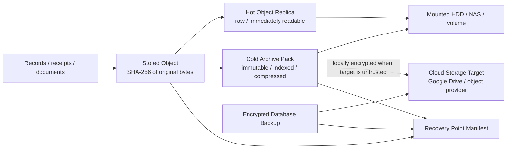
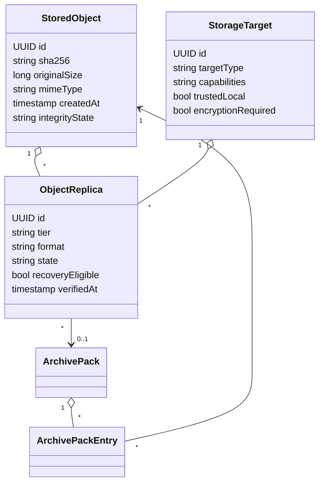
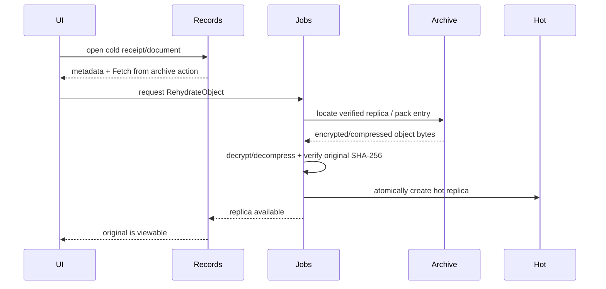
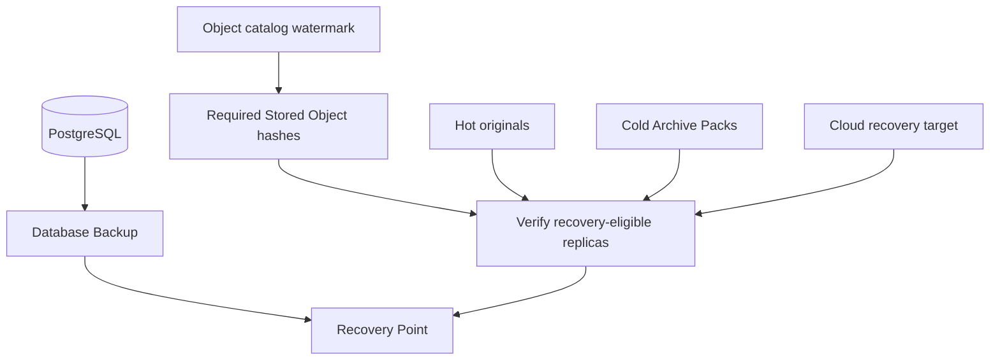

# Storage lifecycle, archive, and recovery

Kind: explanation

Pryvance treats document/receipt originals as durable evidence, but it does not require every original to remain as an unpacked file on the primary application disk forever. Storage lifecycle and disaster recovery are related but separate concerns.

The target design uses content-addressed Stored Objects, configurable Storage Targets, hot and cold Object Replicas, immutable Archive Packs, and independently verifiable database/object recovery streams.

## Goals

- retain original evidence indefinitely by default;
- prevent the primary application disk from growing without bound;
- allow hot storage on local SSD and cold storage on a Docker-mounted HDD/NAS or cloud target;
- allow an encrypted cloud cold replica to also satisfy the object-backup requirement;
- rehydrate an individual archived object on demand;
- preserve content identity regardless of compression/tiering;
- keep database recovery independent from bulk document transfer;
- make recovery health prove that both metadata/database state and required objects are recoverable.

## Storage model



A Stored Object is the canonical identity of the original bytes. Its SHA-256 is calculated before tiering or compression. A JPEG, PDF, CSV, image, statement, policy illustration, receipt, or other source artifact keeps the same Stored Object identity regardless of where or how replicas are stored.

## Storage Target

A Storage Target is a configured location that can hold object replicas, archive packs, and/or backup artifacts.

Supported target families include:

- application-local filesystem/volume;
- Docker-mounted secondary HDD;
- Docker-mounted NAS/network filesystem;
- cloud storage through an External Connection, such as Google Drive or another supported provider;
- future object-storage adapters.

A target declares capabilities and trust/protection attributes rather than being hard-coded as `hot`, `cold`, or `backup`.

Examples:

```text
PrimarySSD
  type: filesystem
  capabilities: HotReplica
  trustedLocal: true

HouseNAS
  type: filesystem
  capabilities: ColdArchive
  trustedLocal: true

GoogleDrive
  type: external-cloud
  capabilities: ColdArchive, DisasterRecovery
  trustedLocal: false
  encryptionRequired: true
```

The same cloud target may therefore serve as both the cold archive and the offsite object-recovery copy. A Household can instead configure separate cold and backup targets if it prefers local cold storage plus an independent offsite backup.

## Stored Object and Object Replica



A Stored Object may have several replicas. Replica state records where the bytes can currently be recovered, not merely where Pryvance once attempted to write them.

Useful replica states include `creating`, `available`, `verifying`, `failed`, `missing`, `retiring`, and `deleted`.

## Hot tier

Hot replicas are optimized for immediate viewing and processing. They are normally stored as the original bytes on fast local storage.

A hot-tier policy may consider:

- object age;
- last access/rehydration time;
- document class;
- available disk capacity;
- pinned/never-archive state;
- minimum hot-retention interval.

Moving an object out of hot storage never changes the Stored Object or deletes database facts extracted from it.

Small generated thumbnails/previews may remain hot independently. They are derived/rebuildable artifacts and do not have to be included in disaster-recovery backups when they can be regenerated from the original.

## Cold archive packs

Cold originals are grouped into bounded immutable Archive Packs rather than one unbounded ZIP file.

An Archive Pack contains multiple independently indexed object payloads plus a versioned manifest. The manifest identifies, at minimum:

- Stored Object ID and original SHA-256;
- original size;
- encoding/compression method;
- stored offset/range information when the format supports it;
- stored length;
- per-entry integrity metadata;
- pack format version.

Compression is chosen per object. Already-compressed JPEG/PDF data may be stored with little or no additional compression; compressible text/office/source formats may use a vetted general compression implementation. The exact compression engine is an implementation choice; the architecture does not require ZIP or define a custom codec.

Packs are deliberately bounded in size so a provider that cannot efficiently range-read a single member does not require downloading an enormous lifetime archive merely to rehydrate one receipt.

Once sealed and verified, a pack is immutable. This makes cloud synchronization, integrity checking, retention, and backup semantics safer.

## Encryption of archive targets

Untrusted/external Storage Targets receive only locally encrypted archive artifacts. Pryvance uses an established authenticated-encryption/envelope-encryption implementation; it does not invent cryptographic primitives.

Archive/data encryption keys are distinct from cloud-provider credentials. Key material required to recover encrypted archive packs is recoverable through the separately held Recovery Secret using a vetted key-wrapping/envelope mechanism.

A trusted local/NAS target may store archive packs without an additional application encryption layer if policy permits, although encryption may still be enabled.

## Rehydration



Rehydration is an interactive-priority durable job. A provider/worker failure leaves the Stored Object catalog intact and surfaces failure through Job state/Alert. Pryvance never marks an object hot until the rehydrated original hashes to the Stored Object SHA-256.

A rehydrated hot replica may later age back out according to policy while its cold replica remains intact.

## Archive deletion and compaction

Retention deletion logically removes the live object's eligibility/reference according to policy, but Pryvance does not mutate an immutable pack in place.

Objects removed from live retention become reclaimable entries. A maintenance compaction job may:

1. select packs with sufficient reclaimable space;
2. copy still-live entries into new immutable packs;
3. verify every copied original hash;
4. atomically update active replica locations;
5. mark the old pack retired;
6. delete the old pack only after replacement protection requirements are satisfied.

This avoids risky in-place archive rewrites.

## Database and object recovery are separate streams

Pryvance separates:

1. **Database Backup** — encrypted, versioned PostgreSQL logical backup plus database/schema/catalog metadata;
2. **Object Recovery** — verified recovery-eligible replicas of the Stored Objects required by the database snapshot.

A logical Backup Set/Recovery Point links these two streams; it is not required to be one physical file.



A Recovery Point is healthy only when:

- the Database Backup is created, encrypted, uploaded/placed according to policy, and verified;
- the database snapshot's required Stored Object set is known;
- every required Stored Object is available through at least one verified recovery-eligible replica;
- encryption/recovery material has been verified;
- the recovery manifest is internally consistent.

## Cold tier may satisfy object backup

If a cold Storage Target is itself recovery-eligible—such as a locally encrypted Google Drive archive—Pryvance does not need to upload the same cold object again to a second `document backup` location merely to satisfy recovery.

Example policies:

```text
Policy A
Hot: PrimarySSD
Cold: HouseNAS
Object backup: encrypted GoogleDrive
Database backup: encrypted GoogleDrive
```

```text
Policy B
Hot: PrimarySSD
Cold + object backup: encrypted GoogleDrive
Database backup: encrypted GoogleDrive
```

```text
Policy C
Hot: PrimarySSD
Cold: SecondaryHDD
Object backup: encrypted S3-compatible target
Database backup: separate encrypted provider
```

The UI should report failure-domain/protection state so `cold` is not accidentally mistaken for `offsite backup` when both hot and cold targets are on the same machine.

## Protecting hot-only recent objects

Recent hot objects may not yet qualify for cold archival. The object-backup verifier therefore ensures they still have at least one recovery-eligible copy before a Recovery Point is declared healthy.

When the configured cold target also serves as backup, the system may create an encrypted archive/object replica earlier than normal hot eviction while retaining the hot replica for fast access.

## Restore

A full restore is staged:

1. restore/decrypt the selected Database Backup into isolated storage;
2. read the Recovery Point/object manifest;
3. verify that every required Stored Object can be located on a recovery-eligible Storage Target;
4. restore object catalog/archive metadata;
5. verify representative/all hashes according to restore-test policy;
6. bring the installation online;
7. rehydrate hot originals lazily or eagerly according to restore policy.

A restored installation does not have to copy every cold original back onto the primary SSD. It may reconnect verified cold archives and materialize hot objects on demand.

## Integrity and health

Storage health exposes at least:

- hot bytes / object count;
- cold bytes / pack count;
- reclaimable bytes;
- last archive run;
- last replica verification;
- objects lacking required replica/protection count;
- target capacity/health where available;
- last rehydration failure;
- last compaction status;
- current Database Backup status;
- current Object Recovery status;
- last healthy Recovery Point;
- last restore-test result.

An archive upload is not considered durable merely because a provider returned success; local manifests and remote metadata/content hashes are verified where provider capabilities allow, and restore testing provides the final proof.
