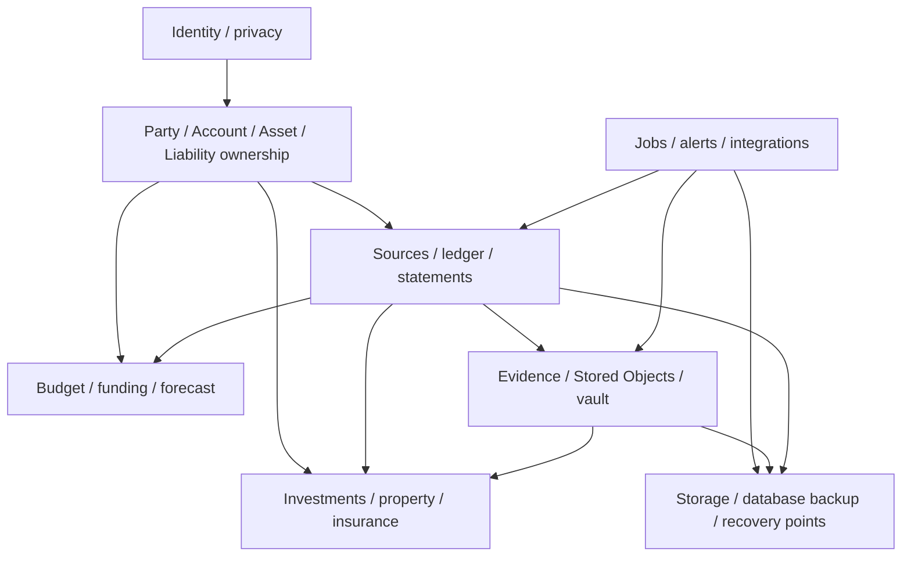
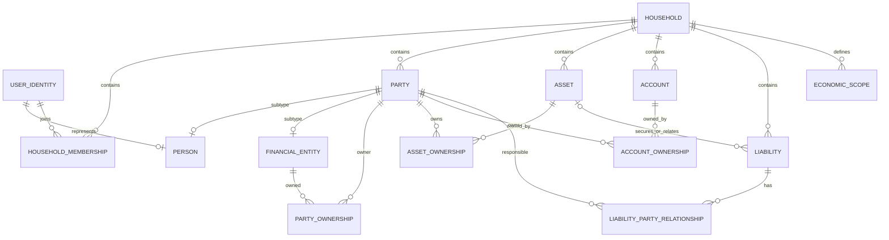
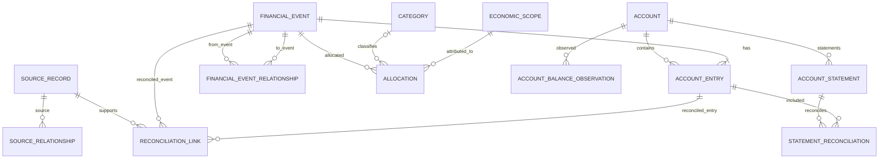
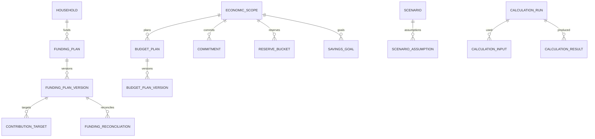
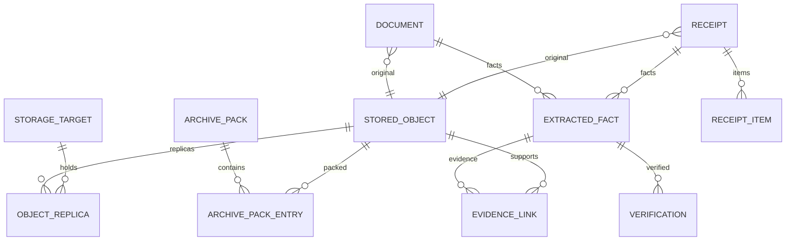
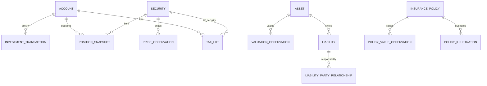
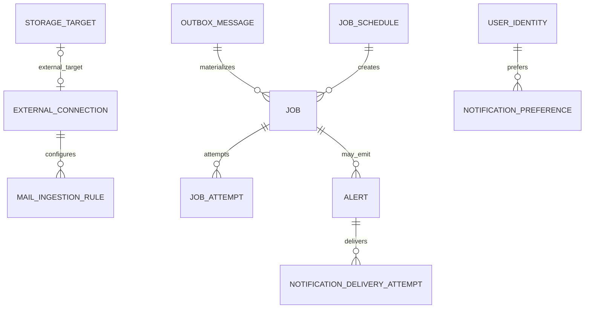
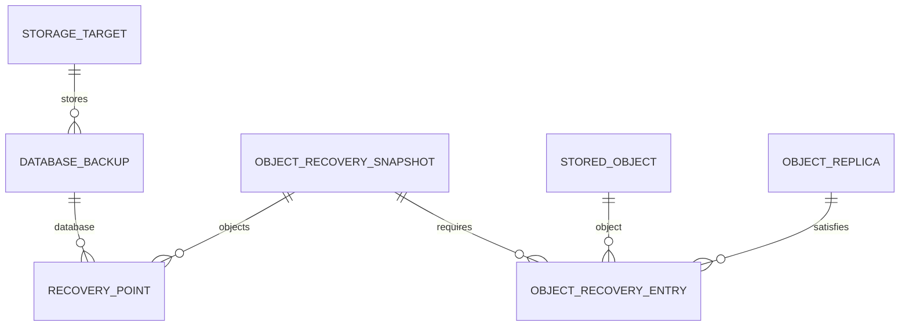

# Target PostgreSQL data model

Kind: reference

This reference translates the feature-complete Pryvance domain model into a relational persistence blueprint. It is not a migration file and does not freeze every convenience column, but implementation must preserve these identities, relationships, temporal semantics, immutability rules, and constraints unless an ADR changes them.

## Persistence principles

- PostgreSQL is the canonical structured-data store.
- IDs are opaque UUIDs.
- `timestamptz` stores instants; financial/effective business dates use `date` when a date—not an instant—is the source fact.
- Source/provider timezone/IANA zone is retained when supplied; user-facing schedules use Household timezone.
- Monetary amounts are decimal/numeric plus ISO currency code; floating-point types are not used for financial amounts/rates.
- Native monetary facts are never overwritten by reporting-currency conversion.
- Immutable source/evidence records are append-only; mutable interpretations are versioned/audited as defined by their aggregate.
- Large original files are Stored Objects outside PostgreSQL; the database stores content identity, replicas, metadata, and provenance.
- JSON/JSONB may retain provider-specific structured payloads/metadata where useful, but stable domain facts remain typed columns/entities.
- All Household-owned data is scoped to the single Household root even though one installation contains only one Household.

## Domain cluster map



Logical code/modules may use PostgreSQL schemas or naming prefixes, but physical database schema separation is an implementation choice. Foreign-key/domain ownership follows the relationships below.

## Identity, parties, ownership, scopes



### Ownership constraints

`PARTY_OWNERSHIP`, `ASSET_OWNERSHIP`, and `ACCOUNT_OWNERSHIP` carry effective-from/effective-to dates and an economic ownership percentage where meaningful.

Entity ownership graphs are cycle-checked before commit. Overlapping effective versions that would make configured economic ownership exceed allowed bounds are rejected or sent to Review according to the owning workflow.

### Liability Party Relationship

Debt responsibility is not inferred from Asset ownership.

A Liability Party Relationship includes:

- Party;
- Liability;
- effective interval;
- role such as borrower, co-borrower, guarantor, economic bearer;
- optional economic share used for net-worth/planning attribution;
- legal-liability semantics when known (for example joint-and-several vs proportional).

Two co-borrowers may each be legally responsible for the full debt while the Household chooses a 50/50 economic-share attribution. Net-worth traversal uses the configured economic share, not the maximum legal collection exposure.

## Sources, ledger, relationships, statements



### Source Record

Append-only source observation. Strong uniqueness uses `(source/provider identity, external record identity)` where available plus deterministic fingerprints for file/manual/import sources. Raw source descriptions/amounts/dates remain immutable.

### Financial Event and Account Entry

Financial Event represents normalized economic meaning. It does **not** require one universal scalar amount because multi-account and cross-currency events may have several legitimate native monetary facts.

Each Account Entry records:

- Account;
- native amount + currency;
- financial/business date;
- occurred-at instant/timezone when supplied;
- posting/value date when supplied;
- direction/sign semantics;
- source/reconciliation identity.

### Economic amount / allocation basis

Economically allocatable events may store or derive an `economic amount`/allocation basis with currency. Example: a restaurant receipt says EUR 120 while a USD card settles USD 131.42. Category/Economic Scope allocations reconcile to the economic/allocation basis, while cash/Account analytics preserve the USD settlement entry.

If no original foreign amount exists, the settlement native amount may be the allocation basis. Adding later evidence can add/correct the interpreted economic basis without mutating the Account Entry/source observation.

Cross-currency transfers do not require an economic-spending amount; the two native Account Entries plus FX Conversion facts define the movement.

### FX Conversion / rate observations

FX conversion facts distinguish:

- **actual conversion/settlement** — observable relationship between linked native amounts;
- **reference FX rate** — historical/current sourced market rate from a configured Fx Rate Provider;
- **derived reporting value** — calculation into the selected reporting/home currency.

Reporting policy prefers actual linked settlement in the reporting currency when it represents the true economic cash impact; otherwise it uses a sourced historical FX rate appropriate to the financial date. Current foreign-currency balances use a selected current/latest rate observation and can be refreshed independently of the native balance.

Household settings define a default/home reporting currency, but reports may override it. Calculation Runs record the reporting currency/rate basis used.

### Financial Event Relationship

Directed semantic link between normalized events. Stable relationship types include at least:

- `refund_of`;
- `partial_refund_of`;
- `reversal_of`;
- `chargeback_of`;
- `reimbursement_for`;
- `adjustment_to`;
- `fee_for`;
- `related_event`.

A relationship may carry an applicable Money amount for partial relationships plus Evidence/Provenance. Analytics use these links to avoid treating refunds/reversals as unrelated spending.

### Account Balance Observation

A sourced balance at an as-of instant/date, including native currency, source, and Coverage/Provenance. Provider balances, statements, and manual observations coexist rather than overwrite one another.

### Statement Reconciliation

Statement reconciliation proves ledger completeness for a period when evidence permits:

```text
opening balance
+ reconciled statement-period activity
= calculated closing balance
vs statement closing balance
= unexplained difference
```

The record identifies opening/closing observations, included Account Entries, statement period, difference, status, and Evidence. An unexplained difference produces Review/Alert according to thresholds.

## Planning, temporal state, and calculation provenance



### Effective time and knowledge time

Historically meaningful plan/ownership/policy rows retain effective intervals. Database audit/knowledge timestamps record when Pryvance learned, verified, created, or changed the state.

Financial source records may therefore carry both a financial/business date and a later learned/observed instant.

### Calculation Run

Important derived decisions/results use a Calculation Run when reproducibility matters. It records:

- calculation type;
- algorithm/calculation version;
- initiated/scheduled time;
- `knowledgeAt` cutoff when applicable;
- reporting currency;
- selected plan/policy version IDs;
- input fact/evidence/reference IDs or stable input manifest/hash;
- Coverage/limitations;
- explicit assumptions;
- output/result references.

Use cases include Funding Reconciliation recommendations, cash forecasts that produce material Alerts, net-worth snapshots, investment performance, scenario runs, and important anomaly decisions.

This supports both `as known now` recomputation and `what exactly supported the recommendation we showed then` without full event sourcing.

## Evidence, documents, and object storage



`STORED_OBJECT.sha256` is unique for original bytes. Duplicate uploads may produce multiple domain references to the same Stored Object rather than duplicate physical content.

Object Replica identity includes Stored Object, Storage Target, representation/pack, and state. A verified `recoveryEligible` replica counts toward object recovery policy.

Archive Packs are immutable once sealed. `ARCHIVE_PACK_ENTRY` maps original Stored Object to pack and indexed location/encoding metadata. Rehydration verifies the original SHA-256 before creating a hot replica.

See [Storage lifecycle, archive, and recovery](../explanation/storage-and-recovery.md).

## Investments, property, insurance



Canonical item IDs plus effective ownership/responsibility paths drive Known Net Worth deduplication. Provider/display duplicates do not create multiple economic assets/liabilities.

## Operations, integrations, alerts



Job state, retries, leases, and outbox behavior are defined in [Background jobs, scheduling, and execution](../explanation/operations-and-jobs.md). Core Alert IDs are defined in [Alert catalog](alert-catalog.md).

## Recovery model



A logical Recovery Point combines a Database Backup and Object Recovery Snapshot. It becomes healthy only when all referenced objects have verified recovery-eligible replicas and the Database Backup is verified.

A cold encrypted cloud replica may satisfy `OBJECT_RECOVERY_ENTRY` directly; the object does not need a duplicate second cloud copy simply because it is also cold-tier storage.

## Important uniqueness / integrity constraints

At minimum, implementation preserves:

- one Household row per installation;
- unique Stored Object SHA-256 for original bytes;
- provider/source external IDs unique within their mapped provider resource where the provider guarantees identity;
- deterministic import fingerprint uniqueness/idempotency boundaries;
- no Financial Entity ownership cycles;
- effective ownership/responsibility overlap validation;
- allocation reconciliation by required dimension/currency;
- no source mutation through derived-record APIs;
- no `succeeded` Job with an active lease;
- unique idempotency/dedup keys inside their declared operation scope;
- sealed Archive Packs immutable;
- healthy Recovery Point only if both database and object requirements verify.

## Indexing guidance

Indexes should exist for the primary query/constraint paths, including:

- Financial Event/Account Entry by Account + financial date;
- source provider/external identity and fingerprints;
- effective ownership by owner/owned object + date;
- allocation by Economic Scope/category + date;
- document/fact schema + tax year/effective period;
- job state + priority + scheduled time + lease expiry;
- alerts by user/scope/status/type/time;
- object replica by Stored Object/target/state;
- archive entry by Stored Object and pack;
- Coverage by subject/fact family/date range.

Exact index composition is validated against measured query plans during implementation.

## Time semantics

Pryvance distinguishes:

- `financialDate` / business date supplied by the financial source;
- provider `occurredAt` / `postedAt` instants where supplied;
- `observedAt` / knowledge time when Pryvance received/learned the fact;
- source timezone/IANA zone when known;
- Household display timezone for schedules/UI.

Budget/month/year attribution normally follows the financial/business date, not a UTC date derived from midnight in another timezone. UTC `timestamptz` remains the canonical instant representation for audit/job/technical ordering.

## U.S. tax scope

The approved Tax workspace targets U.S. federal/state tax evidence and preparation support. The data model does not attempt to model non-U.S. filing systems. Foreign currencies/assets/income Documents can still be stored and analyzed as financial evidence, but Japanese/EU/other tax-return workflows are outside the approved target architecture.
